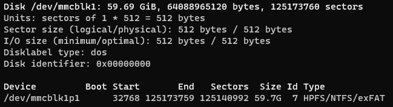
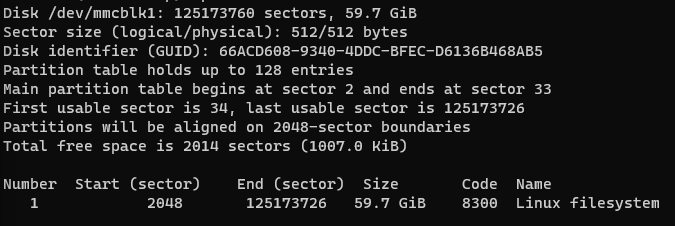

# mount new sdcard
새 SDCARD를 넣고 마운트할려고 할 때 아래와 같이 한다.

SD카드를 연결한다.  
파티션을 확인한다.  

```sh
sudo fdisk -l
```



gdisk로 파티션을 삭제하고 새 파티션을 생성한다.

```
sudo gdisk /dev/mmcblk1
```

p를 눌러 파티션 넘버를 확인한다.  
d를 눌러 파티션을 삭제한다.  
n을 눌러 파티션을 생성한다.  
w를 눌러 저장한다.  



```
sudo mkfs.ext4 /dev/mmcblk1p1
```

마운트한다.  

```
sudo mount -t ext4 /dev/mmcblk1p1 /media/sd
```

