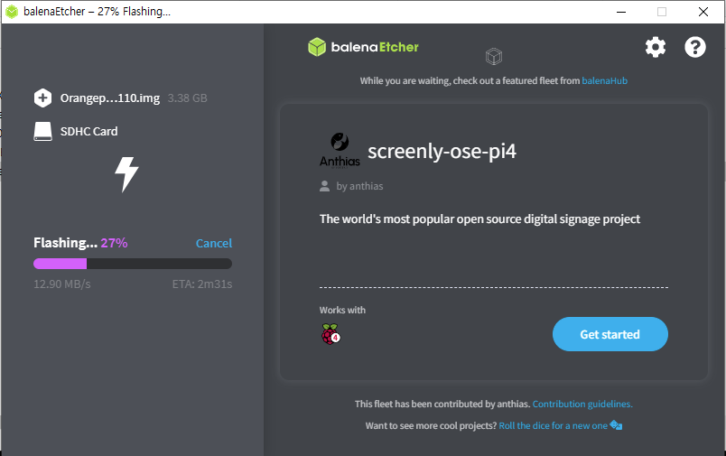
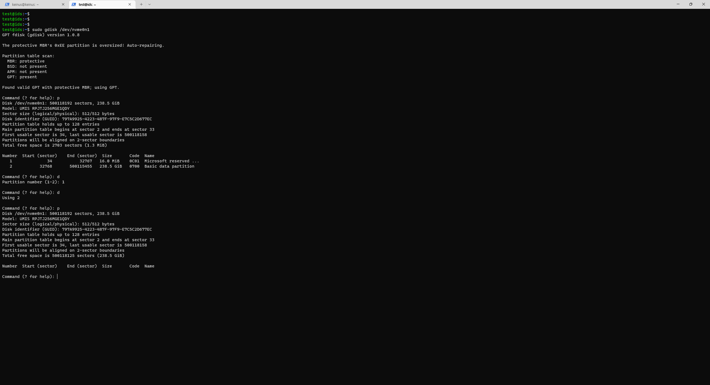
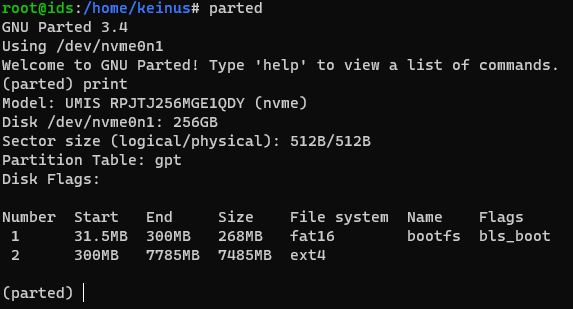
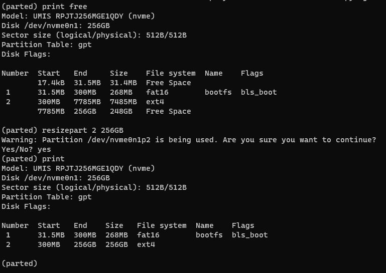

# Orange Pi 5 설치

## 이미지 다운로드
SD 카드에 Ubuntu Server 22.04를 설치하기로 한다.  

[Download Site](https://drive.google.com/drive/folders/1i5zQOg1GIA4_VNGikFl2nPM0Y2MBw2M0 "Download")

위 사이트에서 이미지를 받는다.  
나는 서버를 설치할거기 때문에 Orangepi5_1.1.0_ubuntu_jammy_server_linux5.10.110.7z 파일을 받았다.  
받은 다음 적당한 위치에 압축을 풀어준다.

## balena Echer 다운로드

https://www.balena.io/etcher

위 사이트에서 balenaecher를 다운로드 받는다.

## 이미지 굽기
sd 카드를 컴퓨터에 연결한다.  
위에서 다운로드 받은 파일을 선택하고 target은 sd 카드를 선택한다.  
이미지를 굽는다.(맨 오른쪽 버튼)  

 

## 초기화
sd 카드를 넣고 각종 선을 연결한 후 맨 마지막에 전원을 연결한다.  
부팅 화면을 확인한다.  
기본 계정은 orangepi / orangepi 이다.

## 기본 설정
일단 업데이트 한다.(sudo apt update && sudo apt upgrade -y)
orangepi-config를 입력하여 기본적인 설정을 한다.  

## NVME 설정
일단 NVME 디스크를 초기화한다.  

'''
sudo apt install gdisk
sudo gdisk /dev/nvme0n1
'''

p를 누르고 나오는 파티션을 다 지운다. d를 누르고 파티션 번호를 입력한다.   
다시 p를 눌러서 다 지웠는지 확인한다.



w를 눌러서 저장한다.

~~
새로 하나를 만든다. n을 누르고 나머지는 디폴트로 만든다.  

'''sudo orangepi-config'''를 누르고 System->Install->Boot from SPI->/dev/nvme0n1p1->ext4'''

기다린다. 좀 오래 걸린다.  

다음에 나오는거도 다 YES를 누른다.  
오래 기다린다음 Power Off한다.
**주의: 절대 엔터키 등 무언가 입력하지 말것.**
~~

### 복제
```
sudo su
cat /dev/mmcblk1 > /dev/nvme0n1
```

위 명령어로 디스크를 복제한다. 이하 모든 명령은 root에서 실행해야 한다.  

### SD 카드의 rootfs UUID 변경
해당 파티션에서 부팅을 시도하지 않도록 SD 카드의 UUID를 변경해야 한다.  
기존 UUID(f8724ef2-400f-4f80-ba68-960754e4697c)를 확인하여 어딘가에 복사해놓는다.(NVME 디스크의 UUID로 써야한다.)  

```
tune2fs -U random /dev/mmcblk1p2
```

csum과 관련된 이전 명령에서 오류가 발생하면 대신 다음 명령을 실행하면 된다.

```
tune2fs -O metadata_csum_seed -U random /dev/mmcblk1p2
```

blkid로 변경을 확인한다.  

```
root@orangepi5:~# blkid
/dev/nvme0n1p1: SEC_TYPE="msdos" LABEL_FATBOOT="opi_boot" LABEL="opi_boot" UUID="0257-2A31" BLOCK_SIZE="512" TYPE="vfat" PARTLABEL="bootfs" PARTUUID="0a65713b-d4b4-0642-a3a4-ebc357e507a1"
/dev/nvme0n1p2: LABEL="opi_root" UUID="ae948e48-3646-4f5c-be01-73168e079bc8" BLOCK_SIZE="4096" TYPE="ext4" PARTUUID="7490e84a-f585-944e-9ce6-f275f067a023"
/dev/mmcblk1p1: SEC_TYPE="msdos" LABEL_FATBOOT="opi_boot" LABEL="opi_boot" UUID="0257-2A31" BLOCK_SIZE="512" TYPE="vfat" PARTLABEL="bootfs" PARTUUID="0a65713b-d4b4-0642-a3a4-ebc357e507a1"
/dev/mmcblk1p2: LABEL="opi_root" UUID="37a6ee0a-e61d-470a-9e53-eaf51726942c" BLOCK_SIZE="4096" TYPE="ext4" PARTUUID="4f32d51c-0523-1248-9bc3-092d1f11c594"
```

/dev/nvme0n1p2 와 /dev/mmcblk1p2가 서로 달라야 한다.

### SD카드의 bootfs UUID 변경
다음으로 SD카드의 부팅 파티션의 UUID를 변경한다.  
실행 전 mtools를 설치해야 한다.  

```
apt install mtools
mlabel -N aaaa1111 -i /dev/mmcblk1p1 ::
```

이전 섹션과 동일한 sudo blkid 명령을 사용하여 UUID가 중복된게 있는지 확인한다.


### fsck 실행
재부팅하기 전에 다음과 같이 드라이브에서 fsck를 실행한다.

sudo fsck -yf /dev/nvme0n1p2
이렇게 하면 처음 부팅을 시도할 때 CLI에서 fsck를 실행하지 않아도 된다.

### 용량복구
parted 명령으로 파티션을 확인한다.  
print 명령을하면 파티션이 나오는데 그때, 디스크 크기와 현재 파티션에 기록된 크기가 다르다고 고칠거냐고 물어본다.  
Fix 써서 고친다.

```
parted
print
(Fix)
```
 

이제 늘려보자.

```
resizepart <Part Number> <Size>
```
 

크기는 print free로 열어서 Free Space 보면 나온다. 맞게 입력하자.  
size는 GB를 입력해도 된다.

```
resize2fs -p /dev/nvme0n1p2
```

위 명령으로 파일시스템 크기를 늘린다.

## 계정 생성
sudo useradd [계정이름]
sudo usermod -aG sudo [계정이름]
sudo passwd [계정이름]

## update
sudo apt update && sudo apt upgrade

## docker-compose 설치
sudo apt install docker-compose -y
