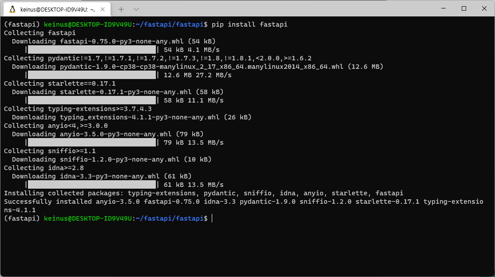
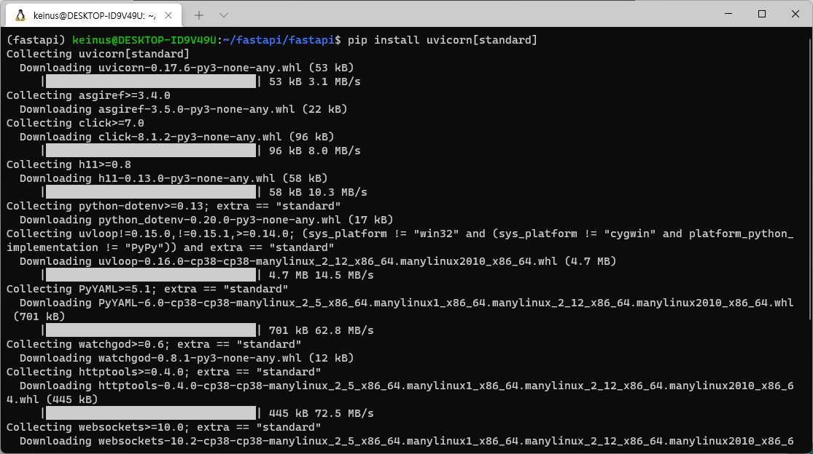
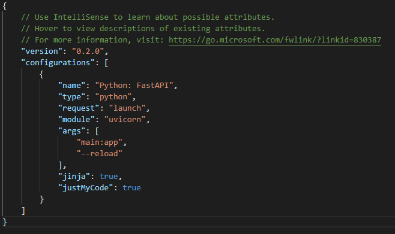
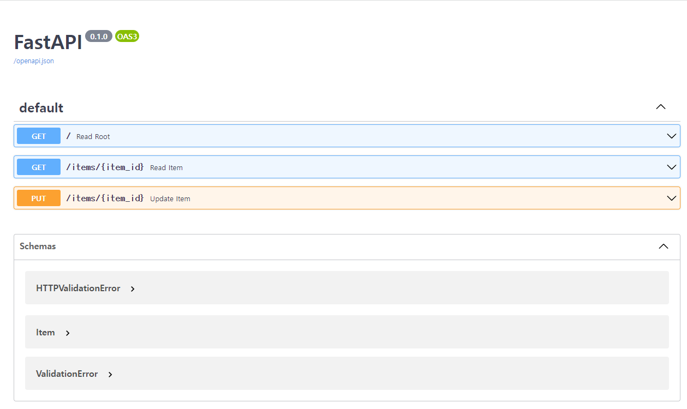
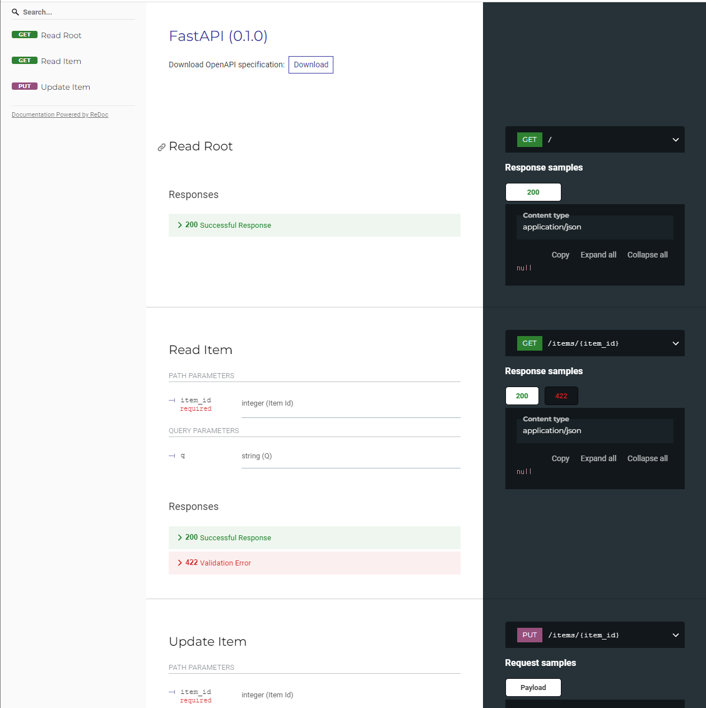

# FastAPI Tutorial

본 문서는 FastAPI 공식 문서의 정리본 입니다.

## FastAPI란

FastAPI는 현대적이고, 빠르며(고성능), 파이썬 표준 타입 힌트에 기초한 Python3.6+의 API를 빌드하기 위한 웹 프레임워크입니다.

### 주요 특징

빠름: (Starlette과 Pydantic 덕분에) NodeJS 및 Go와 대등할 정도로 매우 높은 성능. 사용 가능한 가장 빠른 파이썬 프레임워크 중 하나.
빠른 코드 작성: 약 200%에서 300%까지 기능 개발 속도 증가. *
적은 버그: 사람(개발자)에 의한 에러 약 40% 감소. *
직관적: 훌륭한 편집기 지원. 모든 곳에서 자동완성. 적은 디버깅 시간.
쉬움: 쉽게 사용하고 배우도록 설계. 적은 문서 읽기 시간.
짧음: 코드 중복 최소화. 각 매개변수 선언의 여러 기능. 적은 버그.
견고함: 준비된 프로덕션 용 코드를 얻으십시오. 자동 대화형 문서와 함께.
표준 기반: API에 대한 (완전히 호환되는) 개방형 표준 기반: OpenAPI (이전에 Swagger로 알려졌던) 및 JSON 스키마.
* 내부 개발팀의 프로덕션 애플리케이션을 빌드한 테스트에 근거한 측정

요약 : flast-restx와 비교하여, 빠르고 비동기 지원에 적은 코드량으로 micro service 작성이 가능

### base product
웹 부분을 위한 Starlette.
데이터 부분을 위한 Pydantic.

## Tutorial
python 가상환경 구축 - skip

### fastapi 설치
 

### uvicorn도 설치


### 예제 코드 작성

```py
from typing import Optional

from fastapi import FastAPI
from pydantic import BaseModel

app = FastAPI()


class Item(BaseModel):
    name: str
    price: float
    is_offer: Optional[bool] = None


@app.get("/")
def read_root():
    return {"Hello": "World"}


@app.get("/items/{item_id}")
def read_item(item_id: int, q: Optional[str] = None):
    return {"item_id": item_id, "q": q}


@app.put("/items/{item_id}")
def update_item(item_id: int, item: Item):
    return {"item_name": item.name, "item_id": item_id}

```

### 실행 설정

launch.json



### 실행 테스트
http://localhost:8000/ 로 접속


### OpenAPI 문서
http://127.0.0.1:8000/docs 로 접속

 

### Redoc 문서
http://127.0.0.1:8000/redoc
 


### OpenAPI 주소 정리
Swagger : http://127.0.0.1:8000/docs
ReDoc : http://127.0.0.1:8000/redoc
OpenAPI.Json : http://127.0.0.1:8000/openapi.json
