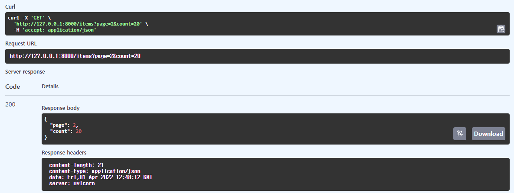
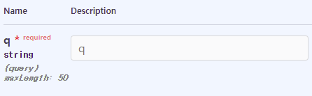
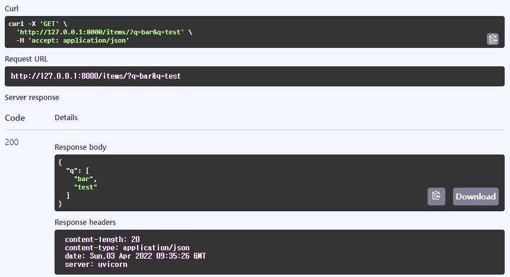

# Query Parameter
쿼리는 URL에서 "?" 뒤에 나오는 key-value 집합을 말한다.
쿼리의 키와 값은 "="로 구분하고 각 키는 "&"로 구분한다.

```
GET /items?page=1&count=10
```

FastAPI는 쿼리 매개변수를 자동으로 해석하여 변수에 할당한다. 만약, 매개변수가 없는데 쿼리에 작성할 경우 무시한다.

```
from fastapi import FastAPI

app = FastAPI()

@app.get("/items")
async def read_item(page: int = 0, count: int = 10):
    return {"page":page, "count":count}
```
 

- 매개변수에 작성하지 않은 키를 쿼리 파라미터에 입력했을 경우 무시한다.
- 디폴트 값이 있을 경우 해당 쿼리를 넣지 않아도 된다.
- 위 코드에서 디폴트 값을 지정하지 않았을 경우, 쿼리 파라미터로 무조건 넣어야 한다. 값을 넣지 않으면 "field required" 에러가 발생한다.
- 필수 쿼리가 아니면서 디폴트 값을 사용하지 않을 경우 가급적 Optional을 사용하고 디폴트로 None을 지정한다.  (q: Optional[str] = None)
- bool 타입의 경우 (1, True, true, on, y, yes)를 전부 True로 인지한다. 
- bool 타입의 경우 (0, false, off, n, no)를 전부 False로 인지한다. 


## Query
위 처럼 작성할 수도 있지만 query에 제약을 사항을 설정할 수 있는 방법도 제공한다.
query 클래스를 사용해보자.

```
from typing import Optional
from fastapi import FastAPI, Query

app = FastAPI()

@app.get("/items/")
async def read_items(q: Optional[str] = Query(None, max_length=50)):
    results = {"items": [{"item_id": "Foo"}, {"item_id": "Bar"}]}
    if q:
        results.update({"q": q})
    return results
```

위처럼 query 함수를 import하고 호출하면 query 객체가 리턴된다.
Query 함수로 설정할 수 있는 값은 코드 뒤져보면 나온다.

```
    default: Any,
    *,
    alias: Optional[str] = None,
    title: Optional[str] = None,
    description: Optional[str] = None,
    gt: Optional[float] = None,
    ge: Optional[float] = None,
    lt: Optional[float] = None,
    le: Optional[float] = None,
    min_length: Optional[int] = None,
    max_length: Optional[int] = None,
    regex: Optional[str] = None,
    example: Any = Undefined,
    examples: Optional[Dict[str, Any]] = None,
    deprecated: Optional[bool] = None,
    include_in_schema: bool = True,
    **extra: Any,
```

### 값에 대한 제약
gt, ge, lt, le는 float 기반으로 값에 대한 제약을 설정한다.

- gt : greater then
- ge : greater equal
- lt : less then
- le : less equal

### 길이 제약
쿼리 길이를 제약할 수 있따.
어차피 http의 URL은 스펙에는 제약이 없으나 각 webserver 별로 최대 길이가 정해져 있다.(보통 10k 이상 길이를 지원하는 서버는 없고 가끔 1024 byte로 빡빡하게 거는 경우도 있다.)

- max_length : 최대 길이
- min_length : 최소 길이

### 정규식
정규식을 걸 수 있다.
굳이 정규식을 써야하나 싶지만... 뭐 지원한다하니..
C-style string 정규식은 어차피 안될거 같으니 js용 정규식을 사용하면 될거 같다.

https://developer.mozilla.org/ko/docs/Web/JavaScript/Guide/Regular_Expressions

### default
None이외 string 값이나 int 값 등 다른 값을 지정해도 된다.

만약 필수 지정값(required)으로 설정하고 싶을 경우, 아래와 같이 "..."을 파라미터로 입력한다.

```
q: Optional[str] = Query(..., max_length=50)
```


required로 변경된 것을 볼 수 있다.

### list
쿼리 파라미터로 리스트를 지정할 수 있다.

```
from typing import List

from fastapi import FastAPI, Query

app = FastAPI()

@app.get("/items/")
async def read_items(q: List[str] = Query(["foo", "bar"])):
    query_items = {"q": q}
    return query_items
```



위와 같이 q에 여러 값을 지정하면 값을 overwrite하는게 아니라 리스트로 추가하여 넣는다.

 
