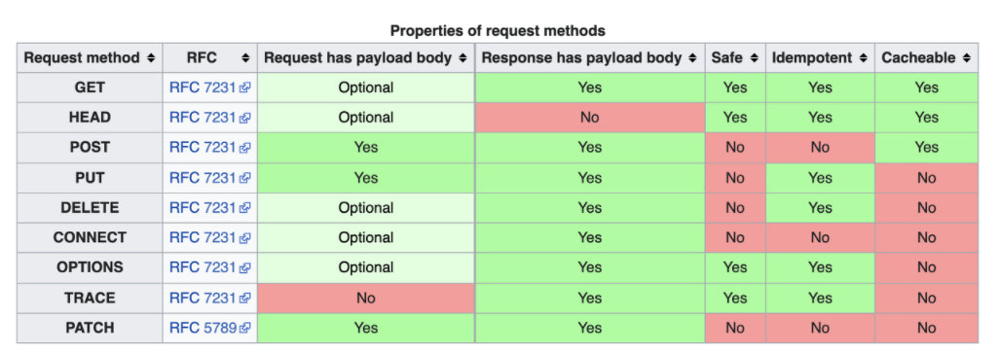
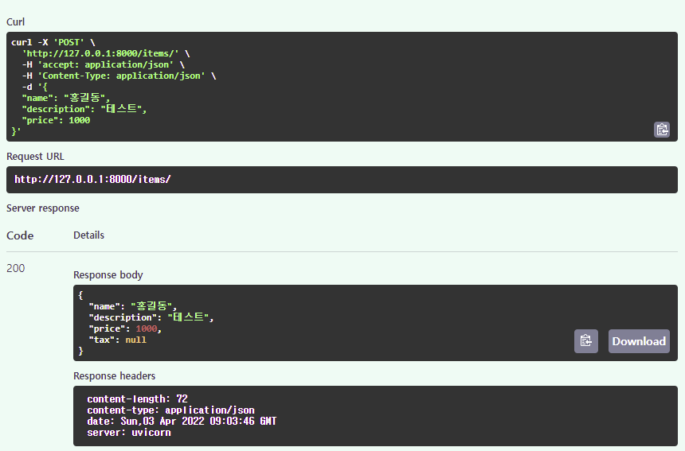
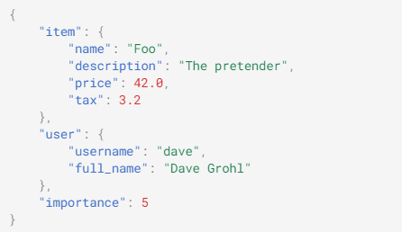
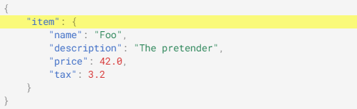

                

# Request Body
HTTP의 content 부분. http에서는 payload body라 한다.

## 사족
### Restful Design
일단 Restful 디자인은 아래 글을 한번은 읽어보자.
https://gmlwjd9405.github.io/2018/09/21/rest-and-restful.html

### 표준
HTTP의 메서드별로 body를 가질 수 있는게 있고, 없는게 있다. 원래는 GET, DELETE는 body를 가질 수 없었으나, RFC가 개정되면서 optional로 바뀌었다.

RFC 표준은 아래와 같다.



저기 보면 optional이라 되어 있는데 이거는 구현체(Webserver, http client 등)에서 구현해도 되고 안해도 된다는 의미다.
따라서, 호환성을 위해서는 안된다고 생각해도 된다.
apache에서는 기본적으로 저 optional이 전부 No로 되어 있는게 default고, 별도의 설정을 통해 구성해야 한다.
JVM은 일정 버전 이하(8u192)에서는 JVM 레벨에서 구현이 안되어 있다.

별개로, 저런 제약 사항 등 때문에 일부 회사에서는 자체 규약을 별도로 만들고 다른 method를 전부 안 쓰고 POST와 PUT으로만 구현하기도 한다.

## FastAPI
fastapi에서 request body는 pydantic을 사용하도록 구현하고 있다.

### Pydantic
사용법은 간단하다. pydantic을 import하고 모델을 생성한 뒤 클래스처럼 사용하면 된다.

```
from typing import Optional
from fastapi import FastAPI
from pydantic import BaseModel

class Item(BaseModel):
    name: str
    description: Optional[str] = None
    price: float
    tax: Optional[float] = None

app = FastAPI()

@app.post("/items/")
async def create_item(item: Item):
    return item
```

위와 같이 구현한 뒤 post 메시지를 받으면 body를 파싱하여 item 객체에 주입된다.



위 테스트코드를 보면 알겠지만 response도 pydantic 객체를 리턴하면 알아서 response body로 변환되어 나간다.

### 데이터 변경
.dict() 함수를 사용해 pydantic 객체의 복제본(dict 타입)을 생성할 수 있다.
원칙적으로 reqeust body로 들어온 pydantic 객체는 생성 후 내부 데이터 변경(property 추가, value 변경 등)이 불가하다.
별도로 변환 등이 필요할 경우 .dict()를 사용해야 한다.

```
@app.post("/items/")
async def create_item(item: Item):
    item_dict = item.dict()
    if item.tax:
        price_with_tax = item.price + item.tax
        item_dict.update({"price_with_tax": price_with_tax})
    return item_dict
```


### Request body + path + query parameters
body, path, query를 같이 사용할 경우 아래와 같이 구현한다. 순서는 상관 없다.

```
@app.put("/items/{item_id}")
async def create_item(item_id: int, item: Item, q: Optional[str] = None):
    result = {"item_id": item_id, **item.dict()}
    if q:
        result.update({"q": q})
    return result
```

### 작동 방식
1. 들어온 HTTP 프로토콜을 파싱하여 body만 읽어와 JSON으로 변환한다.
2. JSON 스트링을 지정된(컨트롤러에서 지정한) 타입으로 변환한다.
3. 위 2번 과정에서 문제 발생 시 예외 처리로 진행한다.(422 리턴)
4. 컨트롤러 호출 시 파라미터로 넣는다.  

  

## Multiple Body
body에 들어오는 데이터 타입을 여러가지를 한꺼번에 설정할 수 있다.

```
from typing import Optional

from fastapi import FastAPI
from pydantic import BaseModel

app = FastAPI()

class Item(BaseModel):
    name: str
    description: Optional[str] = None
    price: float
    tax: Optional[float] = None

class User(BaseModel):
    username: str
    full_name: Optional[str] = None

@app.put("/items/{item_id}")
async def update_item(item_id: int, item: Item, user: User):
    results = {"item_id": item_id, "item": item, "user": user}
    return results
```

위 코드와 같이 Item 모델과 User 모델을 생성하고 파라미터로 지정하면 아래와 같이 request body에 두개의 객체를 받을 수 있다.
물론 N개의 객체를 받는것도 가능하다.


아래와 같이 객체가 아니라 int형 같은 primitive도 가능하다.
이 경우에는 Body함수로 body 객체를 생성해야 한다.

```
from typing import Optional

from fastapi import Body, FastAPI
from pydantic import BaseModel

app = FastAPI()

class Item(BaseModel):
    name: str
    description: Optional[str] = None
    price: float
    tax: Optional[float] = None


class User(BaseModel):
    username: str
    full_name: Optional[str] = None

@app.put("/items/{item_id}")
async def update_item(
    item_id: int, item: Item, user: User, importance: int = Body(...)
):
    results = {"item_id": item_id, "item": item, "user": user, "importance": importance}
    return results
```

위와 같이 item, user, importance 3개의 body 파라미터를 지정한 경우, 아래와 같이 reqeust body를 작성하면 알아서 할당된다.




### Embed a single body parameter
하나의 객체만 parameter로 받는 경우 아래처럼 body가 구성된다.


그런데 client에서 api 호출 시 사용하던 객체를 그대로 body에 넣고 호출하는 경우 라이브러리에 따라서 아래처럼 객체 타입이나 key를 붙여오는 경우가 있다.



이 경우에는 아래처럼 Body 함수를 사용하고 embed 옵션을 True로 지정하면 된다.

```
from typing import Optional

from fastapi import Body, FastAPI
from pydantic import BaseModel

app = FastAPI()


class Item(BaseModel):
    name: str
    description: Optional[str] = None
    price: float
    tax: Optional[float] = None


@app.put("/items/{item_id}")
async def update_item(item_id: int, item: Item = Body(..., embed=True)):
    results = {"item_id": item_id, "item": item}
    return results

``` 
