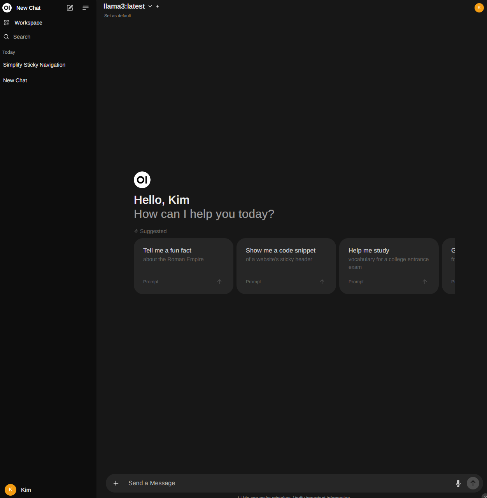
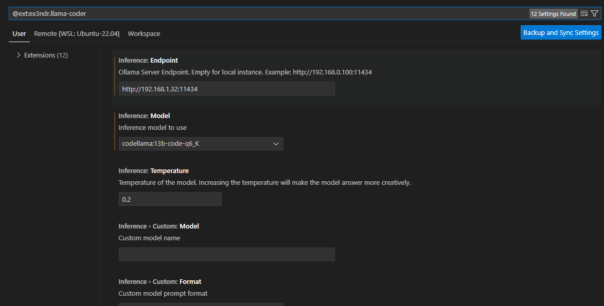

                

# Ollama2를 WSL2, docker-compose로 설치
Windows, WSL2에 RTX 그래픽카드가 설치된 PC에서 ollama를 설치하여 운용하는 것을 시험해보았다.

## WSL2
일단, WSL2에 nvidia gpu 사용이 가능하도록 구성한다.  
nvidia-smi를 실행하여 결과가 나오는 것을 확인한다.  

## docker compose
아래 yaml 파일을 적당히 편집해서 사용한다.  
webui의 extra_hosts에서 OLLAMA_IP로 되어 있는 것은 ollama 컨테이너의 IP를 입력하는 칸이다.  
host IP를 설정해서 사용해봤는데 그냥 host ip를 설정하면 안되고, 
host에 nginx 설치하고 nginx에서 내부 포트포워딩으로 다시 컨테이너로 포워딩하는 형식으로 설정했다.  
컨테이너 환경을 생각 안하고 구현한 프로젝트라서 정히 거슬릴 경우 open-webui 프로젝트 받아서 "host.docker.internal" 부분을 적당히 수정해서 컴파일해서 사용하면 될거 같다.  
nginx 설정은 WSL2 Portforwarding을 위한 NGINX Reverse Proxy 자동화를 참조한다.  
적당히 수정하여 사용한다.

```yaml
services:
  webui:
    image: ghcr.io/open-webui/open-webui:cuda
    container_name: webui
    restart: always
    deploy:
      resources:
        reservations:
          devices:
            - driver: nvidia
              count: 1
              capabilities: [gpu]
    extra_hosts:
      - "host.docker.internal:<OLLAMA_IP>"
    volumes:
      - open-webui:/app/backend/data
    ports:
      - 8080:8080

  ollama:
    image: ollama/ollama
    container_name: ollama
    restart: always
    deploy:
      resources:
        reservations:
          devices:
            - driver: nvidia
              count: 1
              capabilities: [gpu]
    ports:
      - 11434:11434
    volumes:
      - ollama:/root/.ollama


volumes:
  open-webui: {}
  ollama: {}
```

## 시작 후 적용된 화면
아래는 docker compose로 구동한 결과이다.  
<IP>:8080에서 접속하여 사용할 수 있다.  



## code completion
visual studio code 플러그인 중 llama coder를 설치한다.  
설정에서 위 docker로 설치한 ollama의 경로를 지정하면 자동완성이 된다.  



위 그림처럼 URL과 모델을 선택한다.  
나는 13B 모델을 선택하여 사용 중이다.  
GPU는 평균 45% 정도 사용한다.  

참고로, 아래 ## 기타 이하는 code completion을 통해 자동으로 생성된 한글 텍스트이다.(탭만 눌렀다)  
말이 좀 이상한데 적당히 걸러서 사용해야할거 같다.  
한글 주소나 한국 사람 이름이 들어있는 URL 등이 나오는거 보면 한국어 데이터도 어느 정도 학습한듯 싶다.  


## 기타
docker-compose를 사용할 수 있는 곳에서 사용할 수 있을 것 같다.
WSL2에서 구동하더라도 컨테이너를 실행하는 호스트의 GPU가 사용되기 때문에 같은 컴퓨터에서 구동하는 것을 권장한다.
WSL2를 사용하지 않고 docker-compose로 구동하면 된다.
아래는 WSL2에서 구동했을 때의 결과이다.
<IP>:8080에서 접속하여 사용할 수 있다.


