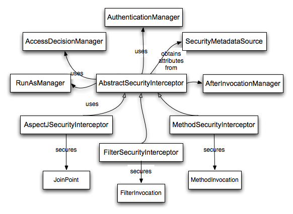

# 9. Architecture and Implementation
## 9.1 Technical Overview
### 9.1.1 Runtime Environment
Spring Security 5.2.1.RELEASE는 Java8 이상을 요구한다. 
자체적으로 모든 것을 할려고 하기 때문에 외부 컴포넌트나 환경 설정이 필요 없이 알아서 작동합니다.

### 9.1.2 Core Components
Spring Security 3.0이 되면서 spring-security-core를 쪼개서 좀 더 세분화 시켰습니다.

### SecurityContextHolder, SecurityContext and Authentication Objects
SecurityContextHolder는 매우 기본적인 객체입니다. 여기에는 어플리케이션의 현재 보안 컨텍스트의 세부사항이 저장되어 있습니다. 디폴트로 SecurityContextHolder는 ThreadLocal을 사용하여 이러한 세부 사항을 저장합니다. 즉, 보안 컨텍스트는 메소드에 대한 인수로 전달되지 않아도 동일한 스레드에서 실행될 경우 사용할 수 있습니다. 따라서, ThreadLocal을 사용하면 요청이 처리 된 후 클리어만 잘 시키면 매우 안전합니다. 물론 스프링 시큐리티는 이를 자동으로 처리합니다.

스레드를 특정 방법으로 사용하는 어떤 어플리케이션은 전체적으로 ThreadLocal을 사용하기 적합하지 않을 수 있습니다. 예를 들면, Swing 클라이언트는 JVM내의 모든 스레드에서 동일한 Security context를 사용하기 원할 수도 있습니다. SecurityContextHolder는 context를 Swing 클라이언트가 원하는 방법으로 저장하기 위해 시작시 전략적으로 구성할 수 있습니다. 독립형 어플리케이션의 경우 SecurityContextHolder.MODE_GLOBAL 전략을 사용합니다. 다른 응용 프로그램은 보안 스레드에 의해 생성 된 스레드가 동일한 보안 ID를 가정하도록 할 수 있습니다. SecurityContextHolder.MODE_INHERITABLETHREADLOCAL을 사용하면 됩니다. 기본 SecurityContextHolder.MODE_THREADLOCAL에서 두 가지 방법으로 모드를 변경할 수 있습니다. 첫 번째는 system property를 설정하는 것이고, 두 번째는 SecurityContextHolder의 static 함수를 호출하는 것입니다. 대부분의 응용 프로그램은 디폴트를 변경할 필요가 없지만, 필요한 경우 SecurityContextHolder의 JavaDoc를 보면 됩니다.

### Obtaining information about the current user
SecurityContextHolder 내부에는 현재 어플리케이션과 통신 중 인 principal(로그인한 사람)의 상세 정보가 저장되어 있습니다. Spring Security는 Authentication 객체를 이용하여 정보를 제공합니다. 개발자는 Authentication 객체를 생성할 필요없이 쿼리를 통해 얻을 수 있습니다. 개발자는 어플리케이션 어디에서나 아래 코드를 호출하여 현재 인증된 사용자 이름 등의 정보를 얻을 수 있습니다.

```
Object principal = SecurityContextHolder.getContext().getAuthentication().getPrincipal();

if (principal instanceof UserDetails) {
    String username = ((UserDetails)principal).getUsername();
} else {
    String username = principal.toString();
}
```

getContext() 함수에서 리턴되는 인스턴스는 SecurityContext 인터페이스 입니다. 이 객체는 thread-local에 저장되어 있습니다. Spring Security의 대부분 인증 메커니즘은 principal(로그인한 사람)의 UserDetails 인스턴스를 리턴합니다.

### The UserDetailsService
위의 예시 코드에서 주목할 또 다른 항목은 Authentication 객체에서 principal 객체를 얻을 수 있다는 것입니다. principal은 단순히 Object 객체입니다. 대부분은 UserDetails 객체로 형변환이 가능합니다. userDetails는 Spring Security의 코어 인터페이스 입니다. 이 클래스는 principal을 표현하는 클래스이며, 확장 가능하고 어플리케이션 별로 다른 내용으로 구현할 수 있습니다. UserDetails는 개발자가 구현한 user 데이터베이스와 Spring Security 내부에서 필요한 SecurityContextHolder 사이의 어댑터로 생각하면 편합니다. 개발자의 user 데이터베이스에서 어떤 데이터를 얻어야할 경우, UserDetails를 개발자가 구현한 클래스로 캐스팅하여 사용할 수 있습니다.(개발자가 구현한 getEmail()이나 getEmployyNumber() 함수처럼)
(역자주) 개발 시 user 클래스를 사용하여 데이터를 구축하고 spring security에는 UserDetails로 캐스팅하여 저장한 후 다시 얻어올 때 user 클래스로 캐스팅하여 사용하라는 의미인듯.

UserDetails 객체를 서비스로 제공해야할 경우 UserDetailsService 인터페이스를 상속받아 서비스를 구현하세요. 이 인터페이스는 loadUserByUsername(String username)이라는 하나의 메서드만 존재합니다. 그리고 UserDetails 객체를 반환하지요

```
UserDetails loadUserByUsername(String username) throws UsernameNotFoundException;
```

이것은 스프링 시큐리티 내에서 사용자 정보를 가져오는 가장 일반적인 방법이며, 사용자 정보가 필요할 때마다 프레임워크 전체에서 사용할 수 있습니다.

인증이 성공하면, UserDetails는 SecurityContextHolder에 저장된 Authentication 객체를 빌드하는데 사용됩니다. Spring Security는 많은 종류의 UserDetailsService 구현을 제공한다는 것입니다.(인-메모리 맵(InMemoryDaoImpl), JDBC(JdbcDaoImpl) 포함) 그러나 대부분의 개발자는 기존에 user 관리 코드를 구현한 DAO(Data Access Object)를 그대로 사용하려는 경향이 있습니다. 하지만 기억하세요. 개발자의 모든 코드 위치에서 SecurityContextHolder의 UserDetailsService를 통해 UserDetails를 가져올 수 있다는 장점이 있음을 말이죠.

> UserDetailsService에 대한 혼동이 종종 있습니다. UserDetailsService는 사용자 데이터에 대한 DAO이며 프레임워크 내의 다른 구성 요소에 해당 데이터를 제공하는 것 외에 다른 기능을 수행하지 않습니다. 특히, 사용자 인증 기능은 제공하지 않습니다. 인증은 AuthenticationManager가 수행합니다. 대부분의 경우, 커스텀 인증 프로세스가 필요한 경우 AuthenticationProvider를 직접 구현하는 것이 좋습니다.

### GrantedAuthority
principal 외에 Authentication에서 제공하는 주요한 함수는 getAuthorities() 입니다. 이 함수는 GrantedAuthority 객체의 배열을 리턴합니다. GrantedAuthority는 principal에 부여된 권한 정보를 담고 있습니다. 권한 정보는 대체로 "역할"을 의미합니다. ROLE_ADMINISTRATOR나 ROLE_HR_SUPERVISOR처럼 사용합니다. 이 역할들은 차후 웹 권한, 함수 권한, 도메인 오브젝트 권한 부여를 위해 설정됩니다. Spring Security의 다른 모듈에서는 이러한 권한 정보를 해석할 수 있으며, 해당 권한 정보가 존재하는 것을 전제로 구현되어 있습니다.(역자주: principal은 authority를 부여해야 합니다.)  GrantedAuthority 객체는 UserDetailsService에 의해 로드됩니다.

일반적으로 GrantedAuthority 객체는 어플리케이션 전체에 권한을 부여합니다. 특정 도메인 객체 별로 권한을 부여할 수 없습니다. 따라서, 특정 employee 객체의 권한을 위한 GrantedAuthority 객체는 없습니다. 그러한 권한이 수천 개이면 메모리가 빨리 부족해질겁니다.(또는 사용자 인증에 시간이 오래걸릴겁니다) 당연히 Spring Security는 이 공통 요구사항을 처리할 수 있도록 디자인되어 있지만 대신 이 목적을 위해 프로젝트의 도메인 오브젝트 보안 기능을 사용할 것입니다.

### Summary
지금까지 살펴본 Spring Security의 major 기능은 다음과 같습니다.
- SecurityContextHoler : SecurityContext 접근을 위한 기능 제공
- SecurityContext : Authentication 객체와 요청별 보안 정보 제공
- Authentication : Spring Security 방식의 principal 정보
- GrantedAuthority : principal에게 부여된 어플리케이션 전체의 권한 정보
- UserDetails : 어플리케이션의 DAO 또는 기타 보안 데이터 소스를 통해 Authentication 객체를 작성하는 데 필요한 정보를 제공
- UserDetailsService : 전달 받은 String값(ex. username, ID 등)으로 UserDetails 객체를 생성

다음은 인증 프로세스를 알아보겠습니다.

### Authentication
Spring Security는 다양한 인증 환경과 통합될 수 있습니다. 개발자가 다른 컨테이너 관리 인증 기술과 통합하지 않고 Spring Security의 인증을 사용하는 것을 권합니다만 자체 개발한 인증 시스템과의 통합도 잘 지원합니다.

### What is authentication in Spring Security?
다음은 모두에게 익숙한 표준 인증 시나리오 입니다.

1. 사용자는 ID/PW를 입력하여 로그인합니다.
2. 시스템은 ID/PW를 검증합니다.
3. 사용자의 인증 정보(권한 정보 포함)를 획득합니다.
4. 사용자를 위한 보안 정보(security context)가 설정됩니다.
5. 사용자는 현재 보안 컨텍스트 정보에 대해 조작에 필요한 권한을 체크하는 액세스 제어 메커니즘에 의해 잠재적으로 보호되는 일부 조작을 수행 할 가능성이 있습니다. (사용자는 기능을 사용합니다. 모든 기능은 Access Control 메커니즘으로 권한 제어를 받습니다. Access Control 메커니즘은 보안 컨텍스트 정보를 통해 권한을 통제합니다.)

처음 4개의 동작은 인증 프로세스를 구성하므로 Spring Security에서 어떻게 동작하는지 살펴보겠습니다.

1. 사용자에게 username / password를 받아 UsernamePasswordAuthenticationToken 인스턴스(Authentication 인터페이스의 인스턴스)를 생성합니다.
2. 토큰은 유효성 검사를 위해 AuthenticationManager 인스턴스로 전달됩니다.
3. AuthenticationManager는 인증 성공 시 정보가 완전히 채워진 Authentication 인스턴스를 리턴합니다.
4. 보안 컨텍스트는 SecurityContextHolder.getContext().setAuthentication(…) 메서드에 리턴 받은 Authentication 인스턴스를 전달하여 설정됩니다.

이때부터 사용자는 인증 된 것으로 간주됩니다. 예를 들어 몇 가지 코드를 살펴 보겠습니다.

```
import org.springframework.security.authentication.*;
import org.springframework.security.core.*;
import org.springframework.security.core.authority.SimpleGrantedAuthority;
import org.springframework.security.core.context.SecurityContextHolder;

public class AuthenticationExample {
private static AuthenticationManager am = new SampleAuthenticationManager();

public static void main(String[] args) throws Exception {
    BufferedReader in = new BufferedReader(new InputStreamReader(System.in));

    while(true) {
    System.out.println("Please enter your username:");
    String name = in.readLine();
    System.out.println("Please enter your password:");
    String password = in.readLine();
    try {
        Authentication request = new UsernamePasswordAuthenticationToken(name, password);
        Authentication result = am.authenticate(request);
        SecurityContextHolder.getContext().setAuthentication(result);
        break;
    } catch(AuthenticationException e) {
        System.out.println("Authentication failed: " + e.getMessage());
    }
    }
    System.out.println("Successfully authenticated. Security context contains: " +
            SecurityContextHolder.getContext().getAuthentication());
}
}

class SampleAuthenticationManager implements AuthenticationManager {
static final List<GrantedAuthority> AUTHORITIES = new ArrayList<GrantedAuthority>();

static {
    AUTHORITIES.add(new SimpleGrantedAuthority("ROLE_USER"));
}

public Authentication authenticate(Authentication auth) throws AuthenticationException {
    if (auth.getName().equals(auth.getCredentials())) {
    return new UsernamePasswordAuthenticationToken(auth.getName(),
        auth.getCredentials(), AUTHORITIES);
    }
    throw new BadCredentialsException("Bad Credentials");
}
}
```

여기서 우리는 사용자에게 사용자 이름과 암호를 입력하도록 요청하고 인증 절차를 수행하는 작은 프로그램을 작성했습니다. 여기서 구현한 AuthenticationManager는 사용자 이름과 비밀번호가 동일한 모든 사용자를 인증합니다. 모든 사용자에게 단일 역할을 할당합니다. 위의 출력은 다음과 같습니다.

```
Please enter your username:
bob
Please enter your password:
password
Authentication failed: Bad Credentials
Please enter your username:
bob
Please enter your password:
bob
Successfully authenticated. Security context contains: \
org.springframework.security.authentication.UsernamePasswordAuthenticationToken@441d0230: \
Principal: bob; Password: [PROTECTED]; \
Authenticated: true; Details: null; \
Granted Authorities: ROLE_USER
```

일반적으로 이와 같은 코드를 작성할 필요는 없습니다. 인증 프로세스는 일반적으로 내부적으로 처리합니다. 우리는 Spring Security에서 실제로 인증을 구성하는 것에 대한 질문이 아주 간단한 대답임을 보여주기 위해 여기에 코드를 포함 시켰습니다. SecurityContextHolder에 완전히 채워진 Authentication 개체가 포함되어 있으면 사용자가 인증됩니다.

###Setting the SecurityContextHolder Contents Directly
사실, Spring Security는 SecurityContextHolder에 Authentication 객체를 어떻게 넣는지 관심이 없습니다. 단, SecurityContextHolder가 AbstractSecurityInterceptor에서 사용자 요청을 인증하기 전에 Authentication 객체를 가지고만 있으면 됩니다. 
Spring Security는 Spring Security 베이스로 구현하지 않은 인증시스템과의 연동을 위해 커스텀 필터나 MVC 컨트롤러를 구현할 수 있습니다. 예를 들어, 컨테이너 관리 인증을 사용하여 ThreadLocal 또는 JNDI 위치에서 현재 사용자를 만들고 사용할 수 있습니다. 또는, 레거시 인증 시스템이있는 회사에서 일할 수도 있습니다. 이 시스템은 통제력이 거의없는, 회사 "표준"입니다. 이와 같은 상황에서도 Spring Security는 작동하기 쉽고 승인 기능을 제공하는 것이 매우 쉽습니다. 개발자는 third파티 사용자 정보를 가져와서 Spring Security의 Authentication 객체를 빌드하고 SecurityContextHolder에 넣는 작업을 하는 필터를 작성하기만 하면 됩니다. 이 경우, 기본 제공되는 인증 시스템에서 자동으로 처리되는 사항들도 고려해야 합니다. 예를 들어, 클라이언트에 응답을 작성하기 전에 요청간에 컨텍스트를 캐시하기 위해 HTTP 세션을 사전에 작성해야 할 수도 있습니다[1].

실제 예에서 AuthenticationManager가 어떻게 구현되는지 궁금하다면 core service 챕터에서 이를 살펴 보겠습니다.

### 9.1.4 Authentication in a Web Application
이제 web.xml 보안을 사용하지 않고 웹 애플리케이션에서 Spring Security를 ​​사용하는 상황을 살펴 보겠습니다. 사용자 인증 및 보안 컨텍스트는 어떻게 설정됩니까?
일반적인 웹 응용 프로그램의 인증 프로세스를 생각해봅시다.

1. 사용자는 홈페이지를 방문하여 링크를 클릭합니다.
2. 요청이 서버로 전달될 것이고 서버는 보호된 자원(protected resource)를 요청한 것으로 간주할 것입니다.
3. 현재 사용자는 인증된 상태가 아니므로, 서버는 사용자가 인증 받아야된다는 응답을 할 것입니다. 응답(response)는 HTTP response code 또는 특정 웹페이지로 redirect 입니다.
4. 인증 메커니즘에 따라 브라우저는 양식을 작성할 수 있도록 특정 웹페이지로 리디렉션되거나 브라우저가 어떤 방식으로 당신의 정보를 가져옵니다.(인증 대화상자, 쿠키, X.509 등)
5. 브라우저는 서버로 응답을 보낼 것입니다. 응답에는 양식에 작성된 정보가 포함된 HTTP POST이거나, 인증 세부 정보가 포함된 HTTP Header가 포함되어 있을 것입니다.
6. 다음으로 서버는 제시된 자격 증명이 유효한지 여부를 결정합니다. 이들이 유효하면 다음 단계가 진행됩니다. 잘못된 경우 일반적으로 브라우저에 다시 시도하라는 메시지가 표시되므로 위의 2 단계로 돌아갑니다.
7. 인증 프로세스를 유발 한 원래 요청이 재 시도됩니다. 보호 된 리소스에 액세스 할 수있는 충분한 권한이 부여 된 인증을 받았기를 바랍니다. 충분한 액세스 권한이 있으면 요청이 성공합니다. 그렇지 않으면 "금지됨"이라는 HTTP 오류 코드 403이 다시 나타납니다.

Spring Security에는 위에서 설명한 대부분의 단계를 담당하는 고유 한 클래스가 있습니다. 주요 참가자(사용 순서대로)는 ExceptionTranslationFilter, AuthenticationEntryPoint, 이전 섹션에서 본 AuthenticationManager를 호출하는 "authentication mechanism" 입니다.

### ExceptionTranslationFilter
ExceptionTranslationFilter는 발생하는 모든 Spring Security의 예외를 감지하는 Spring Security 필터입니다. 이러한 예외는 일반적으로 인증 서비스의 주요 공급자 인 AbstractSecurityInterceptor에 의해 발생합니다. 다음 섹션에서 AbstractSecurityInterceptor에 대해 논의하지만 지금은 Java 예외 발생 이유와 HTTP 또는 principal 인증에 대해 아는 것이 없음을 알아야합니다. 대신, ExceptionTranslationFilter가 오류 코드 403(principal이 인증되었으나 충분한 액세스 권한이 없는 경우, 7번)을 리턴하거나 AuthenticationEntryPoint (principal이 인증되지 않은 경우, 3번)를 런칭하는 역할을 맡고 있습니다.

### AuthenticationEntryPoint
AuthenticationEntryPoint는 위 목록의 3 단계를 담당합니다. 상상할 수 있듯이 각 웹 어플리케이션에는 기본 인증 전략이 있습니다.(이는 Spring Security의 거의 모든 것과 마찬가지로 구성 할 수 있지만 지금은 간단하게 정리하겠습니다) 각 주요 인증 시스템에는 고유한 AuthenticationEntryPoint 구현이 있으며 일반적으로 3 단계에서 설명한 조치 중 하나를 수행합니다.

### Authentication Mechanism
브라우저가 인증 양식(HTTP form POST 또는 HTTP 헤더)을 제출하면 서버에 이러한 인증 세부 정보를 "수집"하는 것이 있어야합니다. 이제 우리는 위 목록의 6 단계를 진행합니다. Spring Security에는 "authentication mechanism"이라고하는 사용자 에이전트(일반적으로 웹 브라우저)에서 인증 세부 정보를 수집하는 특수 이름이 붙은 기능이 있습니다. 양식 기반 로그인 및 Basic authentication이 그 예입니다. 사용자 에이전트에서 인증 세부 정보가 수집되면 Authentication "요청"개체가 구축 된 다음 AuthenticationManager에 제공됩니다.

인증 메커니즘이 완전히 채워진 Authentication 객체를 수신한 후 요청이 유효한 것으로 간주하고 Authentication을 SecurityContextHolder에 넣고 원래 요청을 다시 시도합니다 (위의 7 단계). 반면에 AuthenticationManager가 요청을 거부 한 경우 인증 메커니즘은 사용자 에이전트에게 재시도를 요청합니다 (위의 2 단계).

### Storing the SecurityContext between requests
어플리케이션의 유형에 따라 사용자 작업 간에 보안 컨텍스트를 저장하기 위한 전략이 필요할 수 있습니다. 일반적인 웹 응용 프로그램에서 사용자는 한번 로그인하면 세션 ID로 식별됩니다. 서버는 세션이 유효한 동안에는 principal 정보를 캐시합니다. Spring Security에서 요청 사이에 SecurityContext를 저장하는 책임은 기본적으로 HTTP 컨텍스트 사이에서 HttpSession 속성으로 컨텍스트를 저장하는 SecurityContextPersistenceFilter입니다. 각 요청마다 컨텍스트를 SecurityContextHolder로 복원하고 요청이 완료되면 SecurityContextHolder를 지웁니다. 보안 목적으로 HttpSession과 직접 상호 작용해서는 안됩니다. 그렇게하는 것에 대한 정당성은 없습니다. 대신 항상 SecurityContextHolder를 사용하십시오.
다른 많은 유형의 응용 프로그램(예: stateless RESTful 웹서비스)은 HTTP 세션을 사용하지 않으며 모든 요청에서 다시 인증됩니다. 그러나 각 요청 후에 SecurityContextHolder가 지워지도록 SecurityContextPersistenceFilter가 체인에 포함되어 있어야합니다.

> 단일 세션에서 동시 요청을 수신하는 애플리케이션에서 동일한 SecurityContext 인스턴스가 스레드 간에 공유됩니다. ThreadLocal을 사용하더라도 각 스레드에서 검색한 HttpSession과 동일한 인스턴스입니다. 개발자가 스레드가 실행되는 동안 임시적으로 컨텍스트를 변경하려는 경우 의미가 있습니다. SecurityContextHolder.getContext()를 사용하고 리턴 된 컨텍스트 오브젝트에서 setAuthentication(anAuthentication)을 호출하면 동일한 SecurityContext 인스턴스를 공유하는 모든 동시 스레드에서 Authentication 오브젝트가 변경됩니다. SecurityContextPersistenceFilter의 동작을 사용자 정의하여 각 요청에 대해 완전히 새로운 SecurityContext를 작성하여 한 스레드의 변경 사항이 다른 스레드에 영향을 미치지 않도록 할 수 있습니다. 또는 컨텍스트를 일시적으로 변경하는 시점에 새 인스턴스를 만들 수도 있습니다. SecurityContextHolder.createEmptyContext() 메소드는 항상 새로운 컨텍스트 인스턴스를 리턴합니다.

### 9.1.5 Access-Control (Authorization) in Spring Security
Spring Security에서 access control을 담당하는 기본 인터페이스는 AccessDecisionManager입니다. 여기에는 principal의 액세스 요청을 나타내는 Authentication 객체를 취하는 decide 메서드, "secure object"(아래 참조) 및 객체(예 : 액세스에 필요한 역할 목록)에 적용되는 보안 메타 데이터 속성 목록이 있습니다.

### Security and AOP Advice
AOP에 익숙하다면 여러 유형의 advice가 있음을 알고있을 것입니다(before, after, throws, around). around advice는 메소드 호출을 진행할지 여부, 응답을 수정할지 여부 및 예외를 던질 지 여부를 선택할 수 있기 때문에 매우 유용합니다. Spring Security는 웹 요청뿐만 아니라 메소드 호출에 대한 around advice를 제공합니다. Spring의 표준 AOP 지원을 사용하여 메소드 호출에 대한 around advice를 설정하였고 표준 Filter를 사용하여 웹 요청에 대한 around advice를 제공합니다.

AOP에 익숙하지 않은 사람들은 Spring Security가 웹 요청뿐만 아니라 메소드 호출을 보호 할 수 있다는 점을 이해해야합니다. 대부분의 사람들은 서비스 계층에서 메소드 호출을 보호하는 데 관심이 있습니다. 서비스 계층은 대부분의 비즈니스 로직이 현재 세대 Java EE 애플리케이션에 상주하기 때문입니다. 서비스 계층에서 안전한 메소드 호출을 해야할 경우 Spring의 표준 AOP가 적합합니다. 도메인 객체를 직접 보호해야하는 경우 AspectJ를 고려해 볼 가치가 있습니다.

AspectJ 또는 Spring AOP를 사용하여 메소드 권한 부여를 수행하거나 필터를 사용하여 웹 요청 권한 부여를 수행하도록 선택할 수 있습니다. 이러한 접근 방식 중 0, 1, 2 또는 3을 함께 사용할 수 있습니다. 주류 사용 패턴은 서비스 계층에서 일부 Spring AOP 메소드 호출 권한과 함께 일부 웹 요청 권한 부여를 수행하는 것입니다.

### Secure Objects and the AbstractSecurityInterceptor
어쨌든 "secure object"란 무엇입니까? Spring Security는 이 용어를 사용하여 보안(예 : 권한 결정)을 적용 할 수있는 모든 오브젝트를 나타냅니다. 가장 일반적인 예는 메소드 호출 및 웹 요청입니다.
지원되는 각 secure object 유형에는 자체 인터셉터 클래스가 있으며 이는 AbstractSecurityInterceptor의 서브 클래스입니다. 중요하게도, AbstractSecurityInterceptor가 호출 될 때까지 SecurityContextHolder는 principal이 인증 된 경우 유효한 Authentication을 포함합니다.

AbstractSecurityInterceptor는 일반적으로 다음과 같은 보안 오브젝트 요청을 처리하기위한 일관된 워크 플로우를 제공합니다.

1. 현재 요청과 관련된 "configuration attributes"를 찾습니다.
2. secure object와 현재 Authentication을 제춣하고 권한 결정을 위해 속성 정보를 AccessDecisionManager에 구성
3. 각 호출 요청에 따라 선택적으로 Authentication 변경
4. secure object 호출이 진행되도록 허용 (액세스 권한이 부여되었다고 가정)
5. 호출이 반환되면 AfterInvocationManager(설정 시)를 호출. 호출에서 예외가 발생하면 AfterInvocationManager가 호출되지 않습니다.

### What are Configuration Attributes?
"configuration attribute"는 AbstractSecurityInterceptor에서 사용하는 클래스에 특별한 의미를 갖는 문자열로 생각할 수 있습니다. 프레임워크 내에서 ConfigAttribute 인터페이스로 표시됩니다. AccessDecisionManager 구현이 얼마나 정교한 지에 따라 단순한 역할 이름이거나 더 복잡한 의미를 가질 수 있습니다. AbstractSecurityInterceptor는 보안 오브젝트의 속성을 찾는 데 사용되는 SecurityMetadataSource로 구성됩니다. 일반적으로 이 구성은 사용자에게 표시되지 않습니다. configuration attribute는 보안 메소드의 어노테이션 또는 보안 URL의 액세스 속성으로 입력됩니다. 예를 들어, 네임스페이스 시작부분에서 <intercept-url pattern = '/ secure / **'access = 'ROLE_A, ROLE_B'/>와 같은 것을 발견하면 configuration attribute ROLE_A 및 ROLE_B가 주어진 패턴(pattern)과 일치하는 웹 요청에 적용됩니다. 실제로 기본 AccessDecisionManager 구성을 사용하면이 두 속성 중 하나와 일치하는 GrantedAuthority가있는 사람은 누구나 액세스 할 수 있습니다. 엄밀히 말하면, 이들은 속성 일 뿐이며 해석은 AccessDecisionManager 구현에 따라 다릅니다. 접두사 ROLE_의 사용은 이러한 속성이 역할이며 Spring Security의 RoleVoter가 사용해야 함을 나타내는 표시입니다. 이것은 voter 기반 AccessDecisionManager가 사용중인 경우에만 관련이 있습니다. authorization chapter에서 AccessDecisionManager가 어떻게 구현되는지 살펴 보겠습니다.

### RunAsManager
AccessDecisionManager가 요청을 허용하기로 결정하면 AbstractSecurityInterceptor는 일반적으로 요청을 계속 진행합니다. 그러나 드문 경우지만 사용자는 SecurityContext 내부의 Authentication을 다른 Authentication(RunAsManager를 호출하는 AccessDecisionManager가 핸들링하는)으로 바꾸고 싶을 수도 있습니다.  이는 합리적으로 비정상적인 상황에서 유용할 수 있습니다. 예를 들어, 서비스 계층 메소드가 원격 시스템을 호출해야하는데 다른 ID를 제시해야하는 경우가 있습니다. Spring Security는 한 서버에서 다른 서버로 보안 아이덴티티를 자동으로 전파하기 때문에 (올바로 구성된 RMI 또는 HttpInvoker 원격 프로토콜 클라이언트를 사용한다고 가정 할 때) 유용 할 수 있습니다.

### AfterInvocationManager
보안 객체 호출이 진행된 후 리턴되면(메소드 호출 완료 또는 필터 체인 진행을 의미 할 수 있음) AbstractSecurityInterceptor는 호출을 처리 할 수 있는 마지막 기회를 얻습니다. 이 단계에서 AbstractSecurityInterceptor는 리턴 오브젝트를 수정하는 데 관심이 있습니다. 안전한 객체 호출을 위해 "on the way in"으로 권한 결정을 할 수 없기 때문에 이런 일이 발생할 수 있습니다. AbstractSecurityInterceptor는 필요한 경우 실제로 개체를 수정하기 위해 컨트롤을 AfterInvocationManager에 전달합니다. 이 클래스는 객체를 완전히 대체하거나 예외를 발생 시키거나 원하는 방식으로 변경하지 않을 수도 있습니다. 호출 후 확인은 호출이 성공한 경우에만 실행됩니다. 예외가 발생하면 추가 검사를 건너 뜁니다.

AbstractSecurityInterceptor 및 관련 개체는 그림 9.1. "Security interceptors and the "secure object" model" 에 나와 있습니다.

<center>

**Figure 9.1. Security interceptors and the "secure object" model**
 

</center>

### Extending the Secure Object Model
완전히 새로운 방식으로 요청을 가로 채고 승인하는 방법을 고려하는 개발자만 보안 객체를 직접 사용해야합니다. 예를 들어 메시징 시스템에 대한 호출을 보호하기 위해 새 보안 객체를 구축 할 수 있습니다. 보안이 필요하고 호출을 가로채는 방법 (예 : 어드바이스 시맨틱의 AOP)을 제공하는 모든 것은 안전한 오브젝트로 만들 수 있습니다. 그러나 대부분의 Spring 애플리케이션은 현재 지원되는 세 가지 보안 객체 유형(AOP Alliance MethodInvocation, AspectJ JoinPoint 및 웹 요청 FilterInvocation)을 완벽히 투명하게 제공하여 간단하게 사용할 수 있도록하고 있습니다.


## 9.2 Core Services
이제 Spring Security 아키텍처와 코어 클래스에 대한 개괄적인 개요를 살펴 보았으므로, 한두개 정도의 핵심 인터페이스 및 구현, 특히 AuthenticationManager, UserDetailsService 및 AccessDecisionManager에 대해 자세히 살펴 보겠습니다. 이것들은 문서에서 주기적으로 언급되므로 구성 방법과 작동 방식을 아는 것은 중요합니다.

### 9.2.1 The AuthenticationManager, ProviderManager and AuthenticationProvider
AuthenticationManager는 단지 인터페이스 일 뿐이므로 구현은 무엇이든 선택할 수 있지만 실제로는 어떻게 작동합니까? 여러 인증 데이터베이스 또는 데이터베이스 및 LDAP 서버와 같은 다른 인증 서비스의 조합을 확인해야하는 경우 어떻게해야 합니까?

Spring Security의 기본 구현을 ProviderManager라고하며, 인증 요청을 자체적으로 처리하는 대신 개발자가 설정한 AuthenticationProvider 리스트에 위임합니다. 각 AuthenticationProvider는 차례로 인증을 수행 할 수 있는지 조회합니다. 각 공급자는 예외를 발생 시키거나 완전히 정보가 채워진 Authentication 개체를 반환합니다. 우리의 좋은 친구 인 UserDetails와 UserDetailsService를 기억하십니까? 그렇지 않은 경우 이전 장으로 돌아가 다시 리마인드하고 오세요. 인증 요청을 확인하는 가장 일반적인 방법은 해당 UserDetails를 로드하고 사용자가 입력 한 비밀번호와 비교하여 로드 된 비밀번호를 확인하는 것입니다. DaoAuthenticationProvider에서 사용하는 접근 방식입니다 (아래 참조). 로드 된 UserDetails 객체(특히 그 안에 포함 된 GrantedAuthority)는 인증이 성공해야하고, SecurityContext에 저장되어 있어야만 Authentication 객체를 빌드할 수 있습니다.

네임스페이스를 사용하는 경우, ProviderManager의 인스턴스가 내부적으로 생성 및 유지 관리되고, 개발자는 네임스페이스 인증 공급자 요소를 사용하여 공급자를 추가합니다.(네임스페이스 장 참조). 이 경우, 어플리케이션 컨텍스트에서 ProviderManager Bean을 선언해서는 안됩니다. 그러나 네임 스페이스를 사용하지 않는 경우 다음과 같이 선언할 수 있습니다.

```
<bean id="authenticationManager"
        class="org.springframework.security.authentication.ProviderManager">
    <constructor-arg>
        <list>
            <ref local="daoAuthenticationProvider"/>
            <ref local="anonymousAuthenticationProvider"/>
            <ref local="ldapAuthenticationProvider"/>
        </list>
    </constructor-arg>
</bean>
```

위의 예에는 3 개의 공급자가 있습니다. 인증 기능을 수행하는 순서는 리스트의 순서와 동일합니다. 각 공급자는 인증을 시도하거나 null을 리턴하여 스킵할 수 있습니다. 모든 구현이 null을 돌려주는 경우, ProviderManager는 ProviderNotFoundException을 Throw합니다. 공급자 체인에 대한 자세한 내용은 ProviderManager Javadoc을 참조하십시오.

웹 폼 로그인 처리 필터와 같은 인증 메커니즘에는 ProviderManager에 대한 참조가 삽입되어 인증 요청을 처리하기 위해 이를 호출합니다. 인증 메커니즘은 당신이 구현한 공급자와 상호 교환이 가능하지만 다른 경우에는 특정 인증 메커니즘에 의존합니다. 예를 들어 DaoAuthenticationProvider 및 LdapAuthenticationProvider는 간단한 사용자 이름 / 암호 인증 요청을 제출하는 모든 메커니즘과 호환되므로 폼 기반 로그인 또는 HTTP 기본 인증에서 작동합니다. 반면에 일부 인증 메커니즘은 단일 유형의 AuthenticationProvider에서만 해석 할 수 있는 인증 요청 개체를 만듭니다. 예를 들어 JA-SIG CAS는 서비스 티켓의 개념을 사용하므로 CasAuthenticationProvider에 의해서만 인증 될 수 있습니다. 적합한 제공자 등록을 잊어 버린 경우, 인증을 시도 할 때 단순히 ProviderNotFoundException을 받게되므로 걱정할 필요가 없습니다.

### Erasing Credentials on Successful Authentication
기본적으로 (Spring Security 3.1부터) ProviderManager는 성공적인 인증 요청에 의해 반환되는 Authentication 객체에서 민감한 자격 증명 정보(credentials)를 지우려고 시도합니다. 이렇게하면 암호와 같은 정보가 필요 이상으로 유지되지 않습니다.

단, 몇몇 경우 문제가 발생할 수 있습니다. 예를 들어, stateless 애플리케이션에서 성능 향상을 위해 사용자 정보를 캐시하는 경우가 있습니다. Authentication 객체에 캐시에 저장된 객체(예 : UserDetails 인스턴스)에 대한 참조가 포함되어 있고, 해당 객체에 저장되어 있던 자격 증명이 제거 된 경우, 더 이상 캐시 된 값을 이용하여 인증을 할 수 없습니다. 캐시를 사용하여 사용자 정보를 캐싱하는 경우 이를 고려해야합니다. 확실한 해결책은 캐시 구현 또는 반환 된 Authentication 객체를 생성하는 AuthenticationProvider에서 객체의 복사본을 먼저 만드는 것입니다. 또는 ProviderManager에서 eraseCredentialsAfterAuthentication 속성을 비활성화 할 수 있습니다. 자세한 정보는 Javadoc을 참조하십시오.

### DaoAuthenticationProvider
Spring Security에 의해 구현 된 가장 간단한 AuthenticationProvider는 DaoAuthenticationProvider이며, 이는 프레임워크에서 가장 초기부터 지원되는 것 중 하나입니다. 사용자 이름, 비밀번호 및 GrantedAuthority를 조회하기 위해 UserDetailsService(DAO)를 활용합니다. UsernamePasswordAuthenticationToken에 제출 된 비밀번호와 UserDetailsService가 로드 한 비밀번호를 비교하여 사용자를 인증합니다. 공급자 구성은 매우 간단합니다.

```
<bean id="daoAuthenticationProvider"
    class="org.springframework.security.authentication.dao.DaoAuthenticationProvider">
<property name="userDetailsService" ref="inMemoryDaoImpl"/>
<property name="passwordEncoder" ref="passwordEncoder"/>
</bean>
```

PasswordEncoder는 선택 사항입니다. PasswordEncoder는 구성된 UserDetailsService에서 리턴 된 UserDetails 오브젝트에 표시되는 비밀번호의 인코딩 및 디코딩을 제공합니다. 이에 대해서는 아래에서 더 자세히 설명합니다.


### 9.2.2 UserDetailsService Implementations
이 참조 안내서 앞부분에서 언급했듯이 대부분의 인증 공급자는 UserDetails 및 UserDetailsService 인터페이스를 이용합니다. UserDetailsService의 함수는 하나뿐이라는 것을 기억하세요.

```
UserDetails loadUserByUsername(String username) throws UsernameNotFoundException;
```

리턴 된 UserDetails는 사용자 이름, 비밀번호, 권한 부여 된 권한 및 사용자 계정의 사용 가능 여부와 같은 NULL이 아닌 인증 정보 제공을 보장하는 getter를 제공하는 인터페이스입니다. 사용자 이름과 암호가 실제로 인증 결정의 일부로 사용되지 않더라도 대부분의 인증 공급자는 UserDetailsService를 사용합니다. LDAP 또는 X.509 또는 CAS와 같은 일부 다른 시스템은 자체적으로 인증을 실시하므로, 반환 된 UserDetails 개체의 GrantedAuthority 정보만 사용합니다.

### In-Memory Authentication
선택한 지속 엔진(ex. 데이터베이스)에서 정보를 추출하는 사용자 정의 UserDetailsService 구현을 생성하는 것은 쉽지만 많은 애플리케이션 구현에는 이러한 복잡성이 필요하지 않습니다. 실제로 데이터베이스를 구성하거나 UserDetailsService 구현을 작성하는데 시간을 허비하고 싶지 않을 때, 프로토타입 애플리케이션을 구축하거나 Spring Security를 처음 시작하는 경우 특히 그렇습니다. 이러한 상황에서 간단한 옵션은 security 네임스페이스의 user-service 요소를 사용하는 것입니다.

```
<user-service id="userDetailsService">
<!-- Password is prefixed with {noop} to indicate to DelegatingPasswordEncoder that
NoOpPasswordEncoder should be used. This is not safe for production, but makes reading
in samples easier. Normally passwords should be hashed using BCrypt -->
<user name="jimi" password="{noop}jimispassword" authorities="ROLE_USER, ROLE_ADMIN" />
<user name="bob" password="{noop}bobspassword" authorities="ROLE_USER" />
</user-service>
```

또한 외부 특성 파일 사용을 지원합니다.
```
<user-service id="userDetailsService" properties="users.properties"/>
```

특성 파일은 양식의 항목을 포함해야합니다.
```
username=password,grantedAuthority[,grantedAuthority][,enabled|disabled]
```

예를 들면,
```
jimi=jimispassword,ROLE_USER,ROLE_ADMIN,enabled
bob=bobspassword,ROLE_USER,enabled
```

### JdbcDaoImpl
Spring Security에는 JDBC 데이터 소스에서 인증 정보를 얻을 수있는 UserDetailsService도 포함되어 있습니다. 내부적으로 Spring JDBC가 사용되므로 사용자 세부 정보를 저장하기 위해 완전한 기능을 갖춘 객체 관계 맵퍼 (ORM)의 복잡성을 피할 수 있습니다. 응용 프로그램에서 ORM 도구를 사용하는 경우 이미 만든 매핑 파일을 다시 사용하기 위해 사용자 지정 UserDetailsService를 작성하는 것이 좋습니다. JdbcDaoImpl로 돌아가서 구성 예는 다음과 같습니다.

```
<bean id="dataSource" class="org.springframework.jdbc.datasource.DriverManagerDataSource">
<property name="driverClassName" value="org.hsqldb.jdbcDriver"/>
<property name="url" value="jdbc:hsqldb:hsql://localhost:9001"/>
<property name="username" value="sa"/>
<property name="password" value=""/>
</bean>

<bean id="userDetailsService"
    class="org.springframework.security.core.userdetails.jdbc.JdbcDaoImpl">
<property name="dataSource" ref="dataSource"/>
</bean>
```

위에 표시된 DriverManagerDataSource를 수정하여 다른 관계형 데이터베이스 관리 시스템을 사용할 수 있습니다. 다른 Spring 구성과 마찬가지로 JNDI에서 얻은 글로벌 데이터 소스를 사용할 수도 있습니다.

### Authority Groups
기본적으로 JdbcDaoImpl은 권한이 사용자에게 직접 맵핑된다는 가정하에 단일 사용자에 대한 권한을 로드합니다 (데이터베이스 스키마 부록 참조). 다른 방법은 권한을 그룹으로 분할하고 그룹을 사용자에게 할당하는 것입니다. 어떤 사람들은 이 접근 방식을 사용자 권한 관리 수단으로 선호합니다. 그룹 권한을 사용하는 방법에 대한 자세한 정보는 JdbcDaoImpl Javadoc을 참조하십시오. 그룹 스키마도 부록에 포함되어 있습니다.

