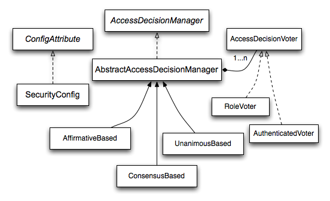
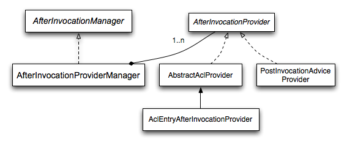

# 11. Authorization
Spring Security의 고급 권한 부여 기능은 가장 인기있는 이유 중 하나를 나타냅니다. Spring Security는 Spring Security에서 제공하는 인증 메커니즘 및 공급자를 사용하거나 컨테이너 기반 인증 또는 다른 비 Spring Security 인증 기능을 사용하는 등의 어떤 인증 방법을 선택하든 애플리케이션에서 일관되고 간단한 권한 부여 서비스를 사용할 수 있습니다. 
이 부분에서는 Part I에서 소개 된 다양한 AbstractSecurityInterceptor 구현에 대해 살펴보고, 도메인 액세스 제어 목록을 사용하여 권한을 미세 조정하는 방법에 대해 알아 보겠습니다.

## 11.1 Authorization Architecture
### 11.1.1 Authorities
기술 개요에서 알 수 있듯이 모든 인증 구현에는 GrantedAuthority 개체 목록이 저장됩니다. 이들은 principal에게 부여 된 권한을 나타냅니다. GrantedAuthority 객체는 AuthenticationManager에 의해 Authentication 객체에 삽입되고 나중에 인증 결정 시 AccessDecisionManager이 해당 정보를 읽어갑니다.
GrantedAuthority는 하나의 메소드 만있는 인터페이스입니다.

```
String getAuthority();
```

이 메소드는 AccessDecisionManager가 GrantedAuthority의 정확한 String 표현을 얻을 수 있도록합니다. 표현을 String로 돌려 주면, 대부분의 AccessDecisionManager가 GrantedAuthority를 쉽게 읽을 수 있습니다. GrantedAuthority를 정확하게 문자열로 표현할 수없는 경우 GrantedAuthority는 "complex" 한것으로 간주되며 getAuthority()는 null을 리턴해야합니다.
"complex" GrantedAuthority의 예는 다른 고객 계정 번호에 적용되는 작업 및 권한 임계 값 목록을 저장하는 구현입니다. 이 복잡한 GrantedAuthority를 문자열로 나타내는 것은 매우 어려우므로 getAuthority() 메소드는 널을 리턴해야합니다. 이는 AccessDecisionManager에게 컨텐츠를 이해하기 위해 GrantedAuthority 구현을 구체적으로 지원해야 함을 나타냅니다.
Spring Security에는 구체적인 GrantedAuthority 구현인 SimpleGrantedAuthority가 포함되어 있습니다. 이를 통해 사용자 지정 문자열을 GrantedAuthority로 변환 할 수 있습니다. 보안 아키텍처에 포함 된 모든 AuthenticationProvider는 SimpleGrantedAuthority를 사용하여 인증 오브젝트를 채웁니다.

### 11.1.2 Pre-Invocation Handling
기술 개요 장에서 보았듯이 Spring Security는 메소드 호출 또는 웹 요청과 같은 보안 객체에 대한 액세스를 제어하는 인터셉터를 제공합니다. 호출이 진행될 수 있는지에 대한 사전 호출 결정은 AccessDecisionManager에 의해 결정됩니다.

### The AccessDecisionManager
AccessDecisionManager는 AbstractSecurityInterceptor에 의해 호출되며 최종 액세스 제어 결정을 담당합니다. AccessDecisionManager 인터페이스에는 세 가지 메소드가 있습니다.

```
void decide(Authentication authentication, Object secureObject, Collection<ConfigAttribute> attrs) throws AccessDeniedException;

boolean supports(ConfigAttribute attribute);

boolean supports(Class clazz);
```

AccessDecisionManager의 'decide' 메소드는 권한 결정을 내리는데 필요한 모든 관련 정보를 전달합니다. 특히, 보안 오브젝트를 전달하면 실제 보안 오브젝트 호출에 포함 된 인수를 검사 할 수 있습니다. 예를 들어, 보안 객체가 MethodInvocation이라고 가정 해 봅시다. 모든 Customer 인수에 대해 MethodInvocation을 쿼리하는 것은 매우 쉽습니다. 그런 다음, AccessDecisionManager에서 일종의 보안 로직을 구현하여 해당 principal이 해당 고객에 대해 작동하도록 허용 할 수 있습니다. 액세스가 거부되면 구현 시 AccessDeniedException이 발생합니다.
supports(ConfigAttribute) 메소드는 시작 시 AbstractSecurityInterceptor에 의해 호출되어 AccessDecisionManager가 전달 된 ConfigAttribute를 처리 할 수 있는지 판별합니다. supports(Class) 메소드는 보안 인터셉터 구현에 의해 호출되어 구성된 AccessDecisionManager가 보안 인터셉터가 제공 할 보안 오브젝트 유형을 지원하는지 확인합니다.

### Voting-Based AccessDecisionManager Implementations
사용자는 자신의 AccessDecisionManager를 구현하여 권한 부여의 모든 측면을 제어 할 수도 있지만, Spring Security에는 투표를 기반으로하는 몇 가지 AccessDecisionManager 구현이 포함됩니다. 그림 11.1. “Voting Decision Manager”는 관련 클래스를 보여줍니다.


<center>

**Figure 11.1. Voting Decision Manager**


</center>

이 접근 방식을 사용하여 일련의 AccessDecisionVoter 구현은 권한 결정에 관한 투표를 합니다. 그런 다음 AccessDecisionManager는 투표 평가에 따라 AccessDeniedException을 던질지 여부를 결정합니다.
AccessDecisionVoter 인터페이스에는 세 가지 메소드가 있습니다.

```
int vote(Authentication authentication, Object object, Collection<ConfigAttribute> attrs);

boolean supports(ConfigAttribute attribute);

boolean supports(Class clazz);
```

구체적인 구현은 가능한 값을 AccessDecisionVoter static 필드인 ACCESS_ABSTAIN, ACCESS_DENIED 및 ACCESS_GRANTED에 반영하여 int를 반환합니다. 투표 결정은 승인 결정에 대한 의견이 없는 경우 ACCESS_ABSTAIN을 반환합니다. 의견이 있으면 ACCESS_DENIED 또는 ACCESS_GRANTED를 반환해야합니다.
Spring Security는 투표를 집계하는 세 가지 구체적인 AccessDecisionManager를 제공합니다. ConsensusBased 구현은 기권없는 투표에 대한 합의를 기반으로 액세스 권한을 부여하거나 거부합니다. 투표가 평등하거나 모든 투표가 결석 된 경우 행동을 통제하기 위한 속성이 제공됩니다. AffirmativeBased 구현은 하나 이상의 ACCESS_GRANTED 투표가 수신 된 경우 액세스 권한을 부여합니다 (즉, 하나 이상의 승인 투표가있는 경우 거부 투표는 무시 됨). ConsensusBased 구현과 마찬가지로 모든 유권자가 기권 할 경우 행동을 제어하는 매개 변수가 있습니다. UnanimousBased 제공자는 기권을 무시하고 액세스 권한을 부여하기 위해 만장일치의 ACCESS_GRANTED 투표를 기대합니다. ACCESS_DENIED 투표가 있으면 액세스가 거부됩니다. 다른 구현과 마찬가지로 모든 유권자가 기권 할 경우 행동을 제어하는 매개 변수가 있습니다.
투표를 다르게 집계하는 사용자 정의 AccessDecisionManager를 구현할 수 있습니다. 예를 들어, 특정 AccessDecisionVoter의 투표는 추가 가중치를 받을 수 있지만 특정 투표자의 거부 투표는 거부권(veto)효과를 줄 수 있습니다.

### RoleVoter
Spring Security와 함께 가장 일반적으로 사용되는 AccessDecisionVoter는 간단한 RoleVoter로서, 구성 속성을 간단한 role 이름으로 취급하고 사용자에게 해당 role이 할당 된 경우 액세스 권한을 허용하는 투표를 합니다.
ConfigAttribute가 접두사 ROLE_로 시작하면 투표합니다. 접두사 ROLE_로 시작하는 하나 이상의 ConfigAttributes와 정확히 동일한 String 표현을 (getAuthority() 메소드를 통해) 리턴하는 GrantedAuthority가 있는 경우 액세스 권한을 허용하는 투표를 합니다. ROLE_로 시작하는 ConfigAttribute와 정확히 일치하지 않으면 RoleVoter가 액세스 거부 투표를 합니다. ROLE_로 시작하는 ConfigAttribute가 없으면 RoleVoter는 기권합니다.

### AuthenticatedVoter
우리가 암시적으로 본 또 다른 유권자는 AuthenticatedVoter로 익명, 완전 인증 및 remember-me 인증 사용자를 구별하는데 사용할 수 있습니다. 대부분의 사이트는 remember-me 인증 하에서 특정 제한 액세스를 허용하지만, 전체 액세스를 할려면 로그인을 통해 사용자의 신원을 확인해야합니다.
IS_AUTHENTICATED_ANONYMOUSLY 속성을 사용하여 익명 액세스 권한을 부여한 경우, 이 속성은 AuthenticatedVoter에서 처리되었습니다. 자세한 정보는 이 클래스의 Javadoc을 참조하십시오.

### Custom Voters
분명히, 사용자 정의 AccessDecisionVoter를 구현할 수 있으며 원하는 액세스 제어 로직을 넣을 수 있습니다. 애플리케이션(비즈니스 로직 관련)에 특정하거나 일부 보안 관리 로직을 구현할 수 있습니다. 예를 들어, voter를 사용하여 계정이 정지 된 사용자에 대한 실시간 액세스를 거부하는 방법을 설명하는 블로그 기사가 Spring 웹 사이트에 있습니다.

### 11.1.3 After Invocation Handling
보안 오브젝트 호출을 진행하기 전에 AbstractSecurityInterceptor가 AccessDecisionManager를 호출하지만, 일부 응용 프로그램은 보안 오브젝트 호출로 실제로 리턴 된 오브젝트를 수정하는 방법이 필요합니다. 이를 위해 자체 AOP 관점에서 문제를 쉽게 구현할 수 있지만, Spring Security는 ACL 기능과 통합되는 몇 가지 구체적인 구현이 있는 편리한 후크를 제공합니다.
그림 11.2.“After Invocation Implementation”은 Spring Security의 AfterInvocationManager와 구체적인 구현을 보여줍니다.

<center>

**Figure 11.2. After Invocation Implementation**


</center>
 
Spring Security의 다른 많은 부분과 마찬가지로, AfterInvocationManager에는 AfterInvocationProvider의 목록을 폴링하는 AfterInvocationProviderManager가 하나 구현되어 있습니다. 각 AfterInvocationProvider는 반환 개체를 수정하거나 AccessDeniedException을 throw 할 수 있습니다. 실제로 이전 공급자의 결과가 목록의 다음 공급자에게 전달되므로 여러 공급자가 개체를 수정할 수 있습니다.
AfterInvocationManager를 사용하는 경우 MethodSecurityInterceptor의 AccessDecisionManager가 조작을 허용 할 수 있도록하는 구성 속성이 여전히 필요합니다. 일반적인 Spring Security에 포함된 AccessDecisionManager 구현을 사용하는 경우, 특정 보안 메소드 호출에 대해 정의 된 구성 속성이 없으면 각 AccessDecisionVoter가 투표를 하지 않습니다. 결과적으로 AccessDecisionManager 속성 “allowIfAllAbstainDecisions”가 false이면, AccessDeniedException이 발생합니다. 이 잠재적인 문제를 해결하기 위해, (i) “allowIfAllAbstainDecisions”를 true로 설정하거나 (일반적으로 권장하지는 않지만) (ii) AccessDecisionVoter가 액세스 권한을 부여하기 위해 투표 할 구성 속성이 하나 이상 설정하는 것을 강제하면 됩니다. 후자의 (권장) 접근 방식은 일반적으로 ROLE_USER 또는 ROLE_AUTHENTICATED 구성 속성을 통해 달성됩니다.

### 11.1.4 Hierarchical Roles
응용 프로그램의 특정 역할이 다른 역할을 자동으로 "포함"해야하는 것이 일반적인 요구 사항입니다. 예를 들어, "admin"및 "user" 역할의 개념을 가진 응용 프로그램에서 관리자는 일반 사용자가 할 수 있는 모든 것을 관리자도 할 수 있기를 원할 것입니다. 이를 위해 모든 관리자에게 "사용자" 역할이 할당되도록 할 수도 있습니다. 또는 "admin"역할을 포함하기 위해 "user"역할이 필요한 모든 액세스 제한 조건을 수정할 수 있습니다. 이것은 응용 프로그램에서 다양한 역할을 수행하는 경우 상당히 복잡해질 수 있습니다.
role-hierarchy(역할 계층)을 사용하면 다른 역할(또는 권한)을 포함 할 역할을 구성 할 수 있습니다. Spring Security의 RoleVoter의 확장 버전 인 RoleHierarchyVoter는 RoleHierarchy로 구성되며, 사용자로부터 할당 된 모든 "도달 가능한 권한"을 얻습니다. 일반적인 구성은 다음과 같습니다.

```
<bean id="roleVoter" class="org.springframework.security.access.vote.RoleHierarchyVoter">
    <constructor-arg ref="roleHierarchy" />
</bean>
<bean id="roleHierarchy"
        class="org.springframework.security.access.hierarchicalroles.RoleHierarchyImpl">
    <property name="hierarchy">
        <value>
            ROLE_ADMIN > ROLE_STAFF
            ROLE_STAFF > ROLE_USER
            ROLE_USER > ROLE_GUEST
        </value>
    </property>
</bean>
```

여기에는 ROLE_ADMIN ⇒ ROLE_STAFF ⇒ ROLE_USER ⇒ ROLE_GUEST 계층 구조의 4 가지 역할이 있습니다. ROLE_ADMIN으로 인증 된 사용자는 위의 RoleHierarchyVoter로 구성된 AccessDecisionManager에 대해 보안 제한 조건이 평가 될 때 4 가지 역할을 모두 갖는 것처럼 작동합니다. > 기호는 "포함"을 의미하는 것으로 생각할 수 있습니다.
역할 계층은 응용 프로그램에 대한 액세스 제어 구성 데이터를 단순화하거나 사용자에게 할당해야하는 권한 수를 줄이는 편리한 방법을 제공합니다. 보다 복잡한 요구 사항의 경우 응용 프로그램에 필요한 특정 액세스 권한과 사용자에게 할당 된 역할 간의 논리적 매핑을 정의하여 사용자 정보를 로드 할 때 둘 사이를 변환 할 수 있습니다.


## 11.2 Secure Object Implementations
### 11.2.1 AOP Alliance (MethodInvocation) Security Interceptor
Spring Security 2.0 이전에는 MethodInvocation 보안에 많은 보일러 플레이트 구성이 필요했습니다. 이제 메소드 보안에 권장되는 방법은 네임스페이스 구성을 사용하는 것입니다. 이렇게 하면 메소드 보안 인프라 Bean이 자동으로 구성되므로 구현 클래스에 대해 실제로 알 필요가 없습니다. 여기서는 여기에 관련된 클래스에 대한 간단한 개요만 설명할 것입니다.
메소드 보안은 MethodInvocation을 보호하는 MethodSecurityInterceptor를 사용하여 시행됩니다. 구성 방식에 따라 인터셉터는 단일 Bean에 고유하거나 여러 Bean간에 공유 될 수 있습니다. 인터셉터는 MethodSecurityMetadataSource 인스턴스를 사용하여 특정 메소드 호출에 적용되는 구성 속성을 얻습니다. MapBasedMethodSecurityMetadataSource는 메소드 이름 (와일드 카드로 표시 가능)으로 키가 지정된 구성 속성을 저장하는 데 사용되며 <intercept-methods> 또는 <protect-point> 요소를 사용하여 응용 프로그램 컨텍스트에서 속성이 정의 될 때 내부적으로 사용됩니다. annotation 기반 구성을 처리하는데에는 다른 구현이 사용됩니다.

### Explicit MethodSecurityInterceptor Configuration
Spring AOP의 프록시 메커니즘 중 하나와 함께 사용하기 위해 애플리케이션 컨텍스트에서 직접 MethodSecurityIterceptor를 구성 할 수 있습니다.

```
<bean id="bankManagerSecurity" class=
    "org.springframework.security.access.intercept.aopalliance.MethodSecurityInterceptor">
<property name="authenticationManager" ref="authenticationManager"/>
<property name="accessDecisionManager" ref="accessDecisionManager"/>
<property name="afterInvocationManager" ref="afterInvocationManager"/>
<property name="securityMetadataSource">
    <sec:method-security-metadata-source>
    <sec:protect method="com.mycompany.BankManager.delete*" access="ROLE_SUPERVISOR"/>
    <sec:protect method="com.mycompany.BankManager.getBalance" access="ROLE_TELLER,ROLE_SUPERVISOR"/>
    </sec:method-security-metadata-source>
</property>
</bean>
```

### 11.2.2 AspectJ (JoinPoint) Security Interceptor
AspectJ 보안 인터셉터는 이전 섹션에서 설명한 AOP Alliance 보안 인터셉터와 매우 유사합니다. 실제로 이 섹션에서는 차이점만 논의 할 것입니다.
AspectJ 인터셉터의 이름은 AspectJSecurityInterceptor입니다. 프록시를 통해 보안 인터셉터를 weaving하기 위해 Spring 애플리케이션 컨텍스트에 의존하는 AOP Alliance 보안 인터셉터와 달리 AspectJSecurityInterceptor는 AspectJ 컴파일러를 통해 weaving 됩니다. AspectJSecurityInterceptor가 도메인 오브젝트 인스턴스 보안에 사용되고 AOP Alliance MethodSecurityInterceptor가 서비스 계층 보안에 사용되는 동일한 애플리케이션에서 두 유형의 보안 인터셉터를 사용하는 것은 드문 일이 아닙니다.
Spring 애플리케이션 컨텍스트에서 AspectJSecurityInterceptor가 어떻게 구성되어 있는지 먼저 살펴 봅시다.

```
<bean id="bankManagerSecurity" class=
    "org.springframework.security.access.intercept.aspectj.AspectJMethodSecurityInterceptor">
<property name="authenticationManager" ref="authenticationManager"/>
<property name="accessDecisionManager" ref="accessDecisionManager"/>
<property name="afterInvocationManager" ref="afterInvocationManager"/>
<property name="securityMetadataSource">
    <sec:method-security-metadata-source>
    <sec:protect method="com.mycompany.BankManager.delete*" access="ROLE_SUPERVISOR"/>
    <sec:protect method="com.mycompany.BankManager.getBalance" access="ROLE_TELLER,ROLE_SUPERVISOR"/>
    </sec:method-security-metadata-source>
</property>
</bean>
```

보시다시피 클래스 이름 외에 AspectJSecurityInterceptor는 AOP Alliance 보안 인터셉터와 정확히 동일합니다. 실제로 두 개의 인터셉터는 SecurityMetadataSource가 AOP 라이브러리 특정 클래스가 아닌 java.lang.reflect.Method와 작동하므로 동일한 securityMetadataSource를 공유 할 수 있습니다. 물론, 액세스 결정은 관련 AOP 라이브러리 특정 호출 (예 : MethodInvocation 또는 JoinPoint)에 액세스 할 수 있으므로 액세스 결정을 내릴 때 다양한 메소드 (예 : 메소드 인수)를 고려할 수 있습니다.

다음으로 AspectJ aspect를 정의해야합니다. 예를 들면 다음과 같습니다.

```
package org.springframework.security.samples.aspectj;

import org.springframework.security.access.intercept.aspectj.AspectJSecurityInterceptor;
import org.springframework.security.access.intercept.aspectj.AspectJCallback;
import org.springframework.beans.factory.InitializingBean;

public aspect DomainObjectInstanceSecurityAspect implements InitializingBean {

    private AspectJSecurityInterceptor securityInterceptor;

    pointcut domainObjectInstanceExecution(): target(PersistableEntity)
        && execution(public * *(..)) && !within(DomainObjectInstanceSecurityAspect);

    Object around(): domainObjectInstanceExecution() {
        if (this.securityInterceptor == null) {
            return proceed();
        }

        AspectJCallback callback = new AspectJCallback() {
            public Object proceedWithObject() {
                return proceed();
            }
        };

        return this.securityInterceptor.invoke(thisJoinPoint, callback);
    }

    public AspectJSecurityInterceptor getSecurityInterceptor() {
        return securityInterceptor;
    }

    public void setSecurityInterceptor(AspectJSecurityInterceptor securityInterceptor) {
        this.securityInterceptor = securityInterceptor;
    }

    public void afterPropertiesSet() throws Exception {
        if (this.securityInterceptor == null)
            throw new IllegalArgumentException("securityInterceptor required");
        }
    }
}
```

위의 예에서 보안 인터셉터는 PersistableEntity의 모든 인스턴스에 적용되며, 이는 추상 클래스가 아닙니다(원하는 다른 클래스 또는 포인트 컷 표현식을 사용할 수 있음). 호기심 많은 사람들에게는 AspectJCallback이 필요합니다. 명령문은 around()함수의 본문 내에서만 특별한 의미를 갖습니다. AspectJSecurityInterceptor는 대상 오브젝트를 계속할 때 이 익명 AspectJCallback 클래스를 호출합니다.
Aspect를 로드하고 AspectJSecurityInterceptor와 연결하도록 Spring을 구성해야 합니다. 이를 달성하는 빈 선언은 다음과 같습니다.

```
<bean id="domainObjectInstanceSecurityAspect"
    class="security.samples.aspectj.DomainObjectInstanceSecurityAspect"
    factory-method="aspectOf">
<property name="securityInterceptor" ref="bankManagerSecurity"/>
</bean>
```

이게 답니다. 이제 당신은 당신이 적합하다고 생각하는 모든 수단(예를 들어, new Person();)을 사용하여 당신의 어플리케이션 내 어디에서나 당신의 bean을 생성 할 수 있고 그것들은 보안 인터셉터를 적용 할 것입니다.

## 11.3 Expression-Based Access Control
Spring Security 3.0은 이전에 보았던 구성 속성 및 액세스 결정 유권자의 간단한 사용 외에도 Spring EL 표현식을 권한 부여 메커니즘으로 사용하는 기능을 도입했습니다. Expression 기반 액세스 제어는 동일한 아키텍처를 기반으로하지만 복잡한 부울 논리를 단일 식으로 캡슐화 할 수 있습니다.

### 11.3.1 Overview
Spring Security는 expression 지원을 위해 Spring EL을 사용하므로 주제를 더 깊이 이해하려는 경우 어떻게 작동하는지 살펴 봐야합니다. expression은 평가 컨텍스트의 일부로 "root object"로 평가됩니다. Spring Security는 웹과 메소드 보안을 위한 특정 클래스를 루트 객체로 사용하여 내장 표현식을 제공하고 현재 principal과 같은 값에 액세스합니다.

### Common Built-In Expressions
expression 루트 객체의 기본 클래스는 SecurityExpressionRoot입니다. 이것은 웹과 메소드 보안 모두에서 사용 가능한 몇 가지 공통 표현을 제공합니다.

**Table 11.1. Common built-in expressions**

| Expression                | Description                                                                                    |
| ------------------------- | ---------------------------------------------------------------------------------------------- |
| hasRole([role])           | 현재 principal에 지정된 역할이 있으면 true를 반환합니다. 제공된 역할이 'ROLE_'로 시작하지 않으면 기본적으로 추가됩니다. DefaultWebSecurityExpressionHandler에서 defaultRolePrefix를 수정하여 사용자 정의 할 수 있습니다. |
| hasAnyRole([role1,role2]) | 현재 principal에 제공된 역할(쉼표로 구분 된 문자열 목록으로 제공됨)이 있으면 true를 반환합니다. 제공된 역할이 'ROLE_'로 시작하지 않으면 기본적으로 추가됩니다. DefaultWebSecurityExpressionHandler에서 defaultRolePrefix를 수정하여 사용자 정의 할 수 있습니다. |
| hasAuthority([authority]) | 현재 주체에 지정된 권한이 있으면 true를 반환합니다. |
| hasAnyAuthority([authority1,authority2]) | 현재 주체에 제공된 권한이있는 경우 true를 리턴합니다 (쉼표로 구분 된 문자열 목록으로 제공됨) |
| principal | 현재 사용자를 나타내는 주체 개체에 직접 액세스 할 수 있습니다 |
| authentication     | SecurityContext에서 얻은 현재 인증 개체에 직접 액세스 할 수 있습니다. |
| permitAll          | 항상 true |
| denyAll            | 항상 false |
| isAnonymous()      | 현재 주체가 익명 사용자 인 경우 true를 반환합니다. |
| isRememberMe()     | 현재 주체가 remember-me 사용자 인 경우 true를 리턴합니다. |
| isAuthenticated()  | 사용자가 익명이 아닌 경우 true를 리턴합니다. |
| isFullyAuthenticated() | 사용자가 익명 사용자 또는 remember-me 사용자가 아닌 경우 true를 리턴합니다. |
| hasPermission(Object target, Object permission) | 사용자가 주어진 권한에 대해 제공된 대상에 액세스 할 수있는 경우 true를 리턴합니다. 예를 들어 hasPermission (domainObject, 'read') |
| hasPermission(Object targetId, String targetType, Object permission) | 사용자가 주어진 권한에 대해 제공된 대상에 액세스 할 수있는 경우 true를 리턴합니다. 예를 들어 hasPermission (1, 'com.example.domain.Message', 'read') |


### 11.3.2 Web Security Expressions
표현식을 사용하여 개별 URL을 보호하려면 먼저 <http> 요소의 use-expressions 속성을 true로 설정해야합니다. 스프링 시큐리티는 <intercept-url> 요소의 액세스 속성이 스프링 EL 표현식을 포함 할 것으로 예상합니다. expression은 Boolean으로 평가하여 액세스 허용 여부를 정의해야합니다. 예를 들면 다음과 같습니다.

```
<http>
    <intercept-url pattern="/admin*"
        access="hasRole('admin') and hasIpAddress('192.168.1.0/24')"/>
    ...
</http>
```
여기에서는 애플리케이션의 "관리자"영역 (URL 패턴으로 정의 됨)이 권한 부여 된 "admin"권한을 가지고 있고 IP 주소가 로컬 서브넷과 일치하는 사용자만 사용할 수 있도록 정의했습니다. 우리는 이미 이전 섹션에서 내장 hasRole 표현을 보았습니다. hasIpAddress 표현식은 웹 보안에 고유한 추가 내장 표현식입니다. WebSecurityExpressionRoot 클래스에 의해 정의되며 인스턴스는 웹 액세스 표현식을 평가할 때 표현식 루트 오브젝트로 사용됩니다. 이 객체는 또한 이름 요청 아래에 HttpServletRequest 객체를 직접 노출하므로 식에서 직접 요청을 호출 할 수 있습니다. 표현식을 사용중인 경우 WebExpressionVoter가 네임 스페이스에서 사용되는 AccessDecisionManager에 추가됩니다. 따라서 네임 스페이스를 사용하지 않고 식을 사용하려는 경우이 중 하나를 구성에 추가해야합니다.

### Referring to Beans in Web Security Expressions
사용 가능한 표현식을 확장하려는 경우 공개하는 모든 Spring Bean을 쉽게 참조 할 수 있습니다. 예를 들어, 다음 메소드 서명이 포함 된 이름이 webSecurity 인 Bean이 있다고 가정하십시오.

```
public class WebSecurity {
        public boolean check(Authentication authentication, HttpServletRequest request) {
                ...
        }
}

```

다음을 사용하여 방법을 참조 할 수 있습니다.

```
<http>
    <intercept-url pattern="/user/**"
        access="@webSecurity.check(authentication,request)"/>
    ...
</http>
```

또는 자바 구현으로, 

```
http
        .authorizeRequests()
                .antMatchers("/user/**").access("@webSecurity.check(authentication,request)")
                ...
```

### Path Variables in Web Security Expressions
때때로 URL 내에서 경로 변수를 참조하는 것이 좋습니다. 예를 들어, URL 경로에서 /user/{userId} 형식의 사용자를 ID별로 찾는 RESTful 애플리케이션을 고려하십시오.
패턴에 배치하여 경로 변수를 쉽게 참조 할 수 있습니다. 예를 들어, 다음 메소드 서명이 포함 된 이름이 webSecurity 인 Bean이있는 경우 :

```
public class WebSecurity {
        public boolean checkUserId(Authentication authentication, int id) {
                ...
        }
}
```

다음을 사용하여 방법을 참조 할 수 있습니다.

```
<http>
    <intercept-url pattern="/user/{userId}/**"
        access="@webSecurity.checkUserId(authentication,#userId)"/>
    ...
</http>
```

또는 자바 구현으로, 

```
http
    .authorizeRequests(authorizeRequests ->
        authorizeRequests
            .antMatchers("/user/{userId}/**").access("@webSecurity.checkUserId(authentication,#userId)")
            ...
    );
```

두 구성에서 일치하는 URL은 경로 변수를 전달하여 checkUserId 메소드로 변환합니다. 예를 들어 URL이 /user/123/resource 인 경우 전달 된 id는 123입니다.

### 11.3.3 Method Security Expressions
메소드 보안은 단순한 허용 또는 거부 규칙보다 조금 더 복잡합니다. Spring Security 3.0은 표현식 사용을 포괄적으로 지원할 수 있도록 몇 가지 새로운 주석을 도입했습니다.

### @Pre and @Post Annotations
사전 및 사후 권한 부여 확인을 허용하고 제출 된 콜렉션 인수 또는 리턴 값의 필터링을 지원하기 위해 표현식 속성을 지원하는 4 개의 어노테이션이 있습니다. @PreAuthorize, @PreFilter, @PostAuthorize 및 @PostFilter입니다. global-method-security 네임 스페이스 요소를 통해 사용할 수 있습니다.

```
<global-method-security pre-post-annotations="enabled"/>
```

### Access Control using @PreAuthorize and @PostAuthorize
가장 분명한 주석은 @PreAuthorize로, 메소드의 실제 호출 가능 여부를 결정합니다. 예를 들어 "Contacts"샘플 응용 프로그램에서

```
@PreAuthorize("hasRole('USER')")
public void create(Contact contact);
```

이는 "ROLE_USER"역할을 가진 사용자에게만 액세스가 허용됨을 의미합니다. 기존의 구성과 필요한 역할에 대한 간단한 구성 속성을 사용하면 동일한 작업을 쉽게 수행 할 수 있습니다. 그러나 :

```
@PreAuthorize("hasPermission(#contact, 'admin')")
public void deletePermission(Contact contact, Sid recipient, Permission permission);
```

여기서는 실제로 현재 사용자에게 주어진 연락처에 대해 "관리자"권한이 있는지 여부를 결정하기 위해 표현식의 일부로 메소드 인수를 사용합니다. 내장 hasPermission() 표현식은 아래에서 볼 수 있듯이 애플리케이션 컨텍스트를 통해 스프링 보안 ACL 모듈에 연결됩니다. 이름으로 표현식 변수로 메소드 인수에 액세스 할 수 있습니다.
Spring Security가 메소드 인수를 해결할 수있는 방법에는 여러 가지가 있습니다. Spring Security는 DefaultSecurityParameterNameDiscoverer를 사용하여 매개 변수 이름을 발견합니다. 기본적으로 다음 옵션은 방법 전체에 대해 시도됩니다.

- Spring Security의 @P 어노테이션이 메소드에 대한 단일 인수에 존재하면 값이 사용됩니다. 이는 매개 변수 이름에 대한 정보가없는 JDK 8 이전의 JDK로 컴파일 된 인터페이스에 유용합니다. 예를 들면 다음과 같습니다. 

```
 import org.springframework.security.access.method.P;

 ...

 @PreAuthorize("#c.name == authentication.name")
 public void doSomething(@P("c") Contact contact);
```

 이 사용은 AnnotationParameterNameDiscoverer를 사용하여 구현되었으며, 지정된 주석의 값 속성을 지원하도록 사용자 정의 할 수 있습니다.

- 메소드에 대해 하나 이상의 매개 변수에 Spring Data의 @Param 어노테이션이 존재하면 값이 사용됩니다. 이는 매개 변수 이름에 대한 정보가없는 JDK 8 이전의 JDK로 컴파일 된 인터페이스에 유용합니다. 예를 들면 다음과 같습니다.

```
import org.springframework.data.repository.query.Param;

...

@PreAuthorize("#n == authentication.name")
Contact findContactByName(@Param("n") String name);

```

AnnotationParameterNameDiscoverer를 사용하여 구현되었으며, 지정된 주석의 값 속성을 지원하도록 사용자 정의 할 수 있습니다.

- JDK 8을 사용하여 -parameters 인수로 소스를 컴파일하고 Spring 4+를 사용하는 경우 표준 JDK 리플렉션 API가 매개 변수 이름을 발견하는 데 사용됩니다. 이것은 클래스와 인터페이스 모두에서 작동합니다.
- 마지막으로 코드가 디버그 기호로 컴파일 된 경우 매개 변수 이름은 디버그 기호를 사용하여 검색됩니다. 매개 변수 이름에 대한 디버그 정보가 없기 때문에 인터페이스에는 작동하지 않습니다. 인터페이스의 경우 주석 또는 JDK 8 접근 방식을 사용해야합니다.

모든 Spring-EL 기능은 표현식 내에서 사용 가능하므로 인수의 특성에 액세스 할 수도 있습니다. 예를 들어, 사용자 이름이 연락처와 일치하는 사용자에게만 액세스를 허용하는 특정 방법을 원한다면

```
@PreAuthorize("#contact.name == authentication.name")
public void doSomething(Contact contact);
```

여기서는 보안 컨텍스트에 저장된 인증 인 또 다른 내장 표현인 authentication에 액세스하고 있습니다. expression principal을 사용하여 "principal"속성에 직접 액세스 할 수도 있습니다. 값은 종종 UserDetails 인스턴스가 되므로 principal.username 또는 principal.enabled와 같은 표현식을 사용할 수 있습니다.
덜 일반적으로, 메소드가 호출 된 후 액세스 제어 점검을 수행 할 수 있습니다. 이것은 @PostAuthorize 주석을 사용하여 달성 할 수 있습니다. 메소드에서 리턴 값에 액세스하려면 표현식에서 내장 이름 returnObject를 사용하십시오.

### Filtering using @PreFilter and @PostFilter
이미 알고 있듯이 Spring Security는 컬렉션 및 배열 필터링을 지원하며 이제 표현식을 사용하여 이를 달성 할 수 있습니다. 이것은 메소드의 반환 값에서 가장 일반적으로 수행됩니다. 예를 들면 다음과 같습니다.

```
@PreAuthorize("hasRole('USER')")
@PostFilter("hasPermission(filterObject, 'read') or hasPermission(filterObject, 'admin')")
public List<Contact> getAll();
```

@PostFilter 어노테이션을 사용할 때 Spring Security는 리턴 된 콜렉션을 반복하고 제공된 표현식이 false 인 요소를 제거합니다. 이름 filterObject는 컬렉션의 현재 객체를 나타냅니다. @PreFilter를 사용하여 메소드 호출 전에 필터링 할 수도 있지만, 이는 덜 일반적인 요구 사항입니다. 구문은 동일하지만 콜렉션 유형 인 인수가 둘 이상인 경우이 주석의 filterTarget 특성을 사용하여 이름으로 하나를 선택해야합니다.
필터링은 데이터 검색 쿼리를 튜닝하는데 있어 대체물이 아닙니다. 큰 모음을 필터링하고 많은 항목을 제거하는 경우 비효율적 일 수 있습니다.

### Built-In Expressions
메소드 보안에 고유 한 일부 내장 표현식이 있으며, 위에서 이미 사용중인 것으로 확인되었습니다. filterTarget 및 returnValue 값은 충분히 단순하지만 hasPermission () 표현식을 사용하면 자세히 살펴볼 수 있습니다.

### The PermissionEvaluator interface
hasPermission() 표현식은 PermissionEvaluator의 인스턴스에 위임됩니다. 이는 표현 시스템과 Spring Security의 ACL 시스템을 연결하기위한 것으로 추상 권한에 따라 도메인 객체에 대한 권한 제한을 지정할 수 있습니다. ACL 모듈에 대한 명시 적 종속성이 없으므로 필요한 경우 대체 구현으로 교체 할 수 있습니다. 인터페이스에는 두 가지 방법이 있습니다.

```
boolean hasPermission(Authentication authentication, Object targetDomainObject, Object permission);

boolean hasPermission(Authentication authentication, Serializable targetId, String targetType, Object permission);
```

첫 번째 인수 (인증 개체)가 제공되지 않는 것을 제외하고는 사용 가능한 식의 버전에 직접 매핑됩니다. 첫 번째는 액세스가 제어되는 도메인 개체가 이미로드 된 상황에서 사용됩니다. 그러면 현재 사용자에게 해당 개체에 대한 주어진 권한이 있으면 expression이 true를 반환합니다. 두 번째 버전은 객체가로드되지 않았지만 식별자가 알려진 경우에 사용됩니다. 올바른 ACL 권한을로드 할 수 있도록 도메인 오브젝트에 대한 추상 "유형"지정자도 필요합니다. 이것은 전통적으로 객체의 Java 클래스 였지만 권한이로드되는 방식과 일치하는 한은 아닙니다.
hasPermission () 표현식을 사용하려면 애플리케이션 컨텍스트에서 PermissionEvaluator를 명시적으로 구성해야합니다. 이것은 다음과 같습니다.

```
<security:global-method-security pre-post-annotations="enabled">
<security:expression-handler ref="expressionHandler"/>
</security:global-method-security>

<bean id="expressionHandler" class=
"org.springframework.security.access.expression.method.DefaultMethodSecurityExpressionHandler">
    <property name="permissionEvaluator" ref="myPermissionEvaluator"/>
</bean>
```

여기서 myPermissionEvaluator는 PermissionEvaluator를 구현하는 Bean입니다. 일반적으로 이것은 AclPermissionEvaluator라고하는 ACL 모듈에서 구현됩니다. 자세한 내용은 "연락처"샘플 응용 프로그램 구성을 참조하십시오.

### Method Security Meta Annotations
메소드 보안을 위해 메타 어노테이션을 사용하여 코드를 더 읽기 쉽게 만들 수 있습니다. 이것은 코드베이스 전체에서 동일한 복잡한 표현을 반복하는 경우에 특히 편리합니다. 예를 들어 다음을 고려하십시오.

```
@PreAuthorize("#contact.name == authentication.name")
```

어디서나 이것을 반복하는 대신, 대신 사용할 수있는 메타 어노테이션을 만들 수 있습니다.

```
@Retention(RetentionPolicy.RUNTIME)
@PreAuthorize("#contact.name == authentication.name")
public @interface ContactPermission {}
```

메타 어노테이션은 모든 Spring Security 함수의 보안 어노테이션에 사용할 수 있습니다. 사양을 준수하기 위해 JSR-250 어노테이션은 메타 어노테이션을 지원하지 않습니다.

## 11.4 Authorize Requests
이 예에서는 사용자의 인증만 요구했으며 애플리케이션의 모든 URL에 대해 그렇게했습니다. http.authorizeRequests() 메소드에 여러 하위를 추가하여 URL에 대한 사용자 정의 요구 사항을 지정할 수 있습니다. 예를 들면 다음과 같습니다.

```
protected void configure(HttpSecurity http) throws Exception {
    http
        .authorizeRequests(authorizeRequests ->                                        1
            authorizeRequests
                .antMatchers("/resources/**", "/signup", "/about").permitAll()         2
                .antMatchers("/admin/**").hasRole("ADMIN")                             3
                .antMatchers("/db/**").access("hasRole('ADMIN') and hasRole('DBA')")   4
                .anyRequest().authenticated()                                          5
        )
        .formLogin(withDefaults());
}
```

1. http.authorizeRequests () 메소드에는 여러 개의 하위가 있습니다. 각 매처는 선언 된 순서대로 고려됩니다.
2. 모든 사용자가 액세스 할 수있는 여러 개의 URL 패턴을 지정했습니다. 특히 URL이 "/resources/"로 시작하거나 "/signup"또는 "/about"과 같은 경우 모든 사용자가 요청에 액세스 할 수 있습니다.
3. "/admin/"으로 시작하는 URL은 "ROLE_ADMIN"역할을 가진 사용자로 제한됩니다. hasRole 메소드를 호출하기 때문에 "ROLE_"접두어를 지정할 필요가 없습니다.
4. "/db/"로 시작하는 URL은 사용자에게 "ROLE_ADMIN"과 "ROLE_DBA"가 모두 있어야합니다. hasRole 표현식을 사용하므로 "ROLE_"접두사를 지정할 필요가 없습니다.
5. 아직 일치하지 않은 URL은 사용자를 인증하기만 하면 됩니다.

## 11.5 Method Security
버전 2.0부터 Spring Security는 서비스 계층 메소드에 보안을 추가하기 위한 지원을 대폭 개선했습니다. JSR-250 어노테이션 보안 및 프레임워크의 원래 @Secured 어노테이션을 지원합니다. 3.0부터는 새로운 expression 기반 주석을 사용할 수도 있습니다. intercept-methods 요소를 사용하여 단일 Bean에 보안을 적용하여 Bean 선언을 장식하거나 AspectJ 스타일 포인트 컷을 사용하여 전체 서비스 계층에서 여러 Bean에 보안을 적용할 수 있습니다.

### 11.5.1 EnableGlobalMethodSecurity
@Configuration 인스턴스에서 @EnableGlobalMethodSecurity annotation을 사용하여 annotation 기반 보안을 활성화 할 수 있습니다. 예를 들어, 다음은 Spring Security의 @Secured annotation을 활성화합니다.

```
@EnableGlobalMethodSecurity(securedEnabled = true)
public class MethodSecurityConfig {
// ...
}
```

그러면 클래스 또는 인터페이스에서 메소드에 annotation을 추가하면 해당 메소드에 대한 액세스가 그에 따라 제한됩니다. Spring Security의 기본 annotation 지원은 메소드의 속성 세트를 정의합니다. 실제 결정을 내리기 위해 AccessDecisionManager로 전달됩니다.

```
public interface BankService {

@Secured("IS_AUTHENTICATED_ANONYMOUSLY")
public Account readAccount(Long id);

@Secured("IS_AUTHENTICATED_ANONYMOUSLY")
public Account[] findAccounts();

@Secured("ROLE_TELLER")
public Account post(Account account, double amount);
}
```

JSR-250 annotation 지원은 다음을 사용하여 활성화 할 수 있습니다.

```
@EnableGlobalMethodSecurity(jsr250Enabled = true)
public class MethodSecurityConfig {
// ...
}
```

이는 표준 기반이며 간단한 role 기반 제약 조건을 적용 할 수 있지만 강력한 Spring Security의 기본 annotation은 없습니다. 새로운 expression 기반 구문을 사용하려면
다음과 같이 사용할 수 있습니다.

```
@EnableGlobalMethodSecurity(prePostEnabled = true)
public class MethodSecurityConfig {
// ...
}
```

동등한 Java 코드는

```
public interface BankService {

@PreAuthorize("isAnonymous()")
public Account readAccount(Long id);

@PreAuthorize("isAnonymous()")
public Account[] findAccounts();

@PreAuthorize("hasAuthority('ROLE_TELLER')")
public Account post(Account account, double amount);
}
```

### 11.5.2 GlobalMethodSecurityConfiguration
때로는 @EnableGlobalMethodSecurity annotation 허용으로 가능한 것보다 복잡한 작업을 수행해야 할 수도 있습니다. 이러한 경우 GlobalMethodSecurityConfiguration을 확장하여 @EnableGlobalMethodSecurity annotation이 서브 클래스에 존재하도록 할 수 있습니다. 예를 들어, 사용자 정의 MethodSecurityExpressionHandler를 제공하려는 경우 다음 구성을 사용할 수 있습니다.

```
@EnableGlobalMethodSecurity(prePostEnabled = true)
public class MethodSecurityConfig extends GlobalMethodSecurityConfiguration {
    @Override
    protected MethodSecurityExpressionHandler createExpressionHandler() {
        // ... create and return custom MethodSecurityExpressionHandler ...
        return expressionHandler;
    }
}
```

대체 할 수있는 메소드에 대한 추가 정보는 GlobalMethodSecurityConfiguration Javadoc을 참조하십시오.

### 11.5.3 The <global-method-security> Element
이 요소는 요소에서 적절한 속성을 설정하여 응용 프로그램에서 주석 기반 보안을 활성화하고 전체 응용 프로그램 컨텍스트에 적용되는 보안 포인트 컷 선언을 그룹화하는 데 사용됩니다. 하나의 <global-method-security> 요소 만 선언해야합니다. 다음 선언은 Spring Security의 @Secured를 지원할 수 있도록합니다.

```
<global-method-security secured-annotations="enabled" />
```

클래스 또는 인터페이스에서 메소드에 주석을 추가하면 해당 메소드에 대한 액세스가 그에 따라 제한됩니다. Spring Security의 기본 주석 지원은 메소드의 속성 세트를 정의합니다. 실제 결정을 내리기 위해 AccessDecisionManager로 전달됩니다.

```
public interface BankService {

@Secured("IS_AUTHENTICATED_ANONYMOUSLY")
public Account readAccount(Long id);

@Secured("IS_AUTHENTICATED_ANONYMOUSLY")
public Account[] findAccounts();

@Secured("ROLE_TELLER")
public Account post(Account account, double amount);
}
```

JSR-250 주석 지원은 다음을 사용하여 활성화 할 수 있습니다.

```
<global-method-security jsr250-annotations="enabled" />
```

이는 표준 기반이며 간단한 역할 기반 제약 조건을 적용 할 수 있지만 강력한 스프링 보안의 기본 주석은 없습니다. 새로운 표현식 기반 구문을 사용하려면

```
<global-method-security pre-post-annotations="enabled" />
```

동등한 Java 코드는

```
public interface BankService {

@PreAuthorize("isAnonymous()")
public Account readAccount(Long id);

@PreAuthorize("isAnonymous()")
public Account[] findAccounts();

@PreAuthorize("hasAuthority('ROLE_TELLER')")
public Account post(Account account, double amount);
}
```

사용자의 권한 목록에서 역할 이름을 확인하는 것 이상의 간단한 규칙을 정의해야하는 경우 식 기반 주석을 사용하는 것이 좋습니다.

> === 어노테이션이있는 메소드는 메소드 Bean이 정의 된 동일한 애플리케이션 컨텍스트에서 Spring Bean으로 정의 된 인스턴스에 대해서만 보안됩니다. Spring에 의해 생성되지 않은 인스턴스를 보호하려면 (예 : 새 연산자 사용) AspectJ를 사용해야합니다. ===

> === 동일한 응용 프로그램에서 여러 유형의 주석을 사용할 수 있지만 인터페이스 나 클래스에는 한 가지 유형 만 사용해야합니다. 그렇지 않으면 동작이 제대로 정의되지 않습니다. 특정 방법에 적용되는 두 가지 주석이 발견되면 그 중 하나만 적용됩니다. ===

### 11.5.4 Adding Security Pointcuts using protect-pointcut
protect-pointcut을 사용하면 간단한 선언만으로 많은 Bean에 보안을 적용 할 수 있으므로 특히 강력합니다. 다음 예제를 고려하십시오.

```
<global-method-security>
<protect-pointcut expression="execution(* com.mycompany.*Service.*(..))"
    access="ROLE_USER"/>
</global-method-security>
```

이것은 클래스가 com.mycompany 패키지에 있고 클래스 이름이 "Service"로 끝나는 응용 프로그램 컨텍스트에 선언 된 Bean의 모든 메소드를 보호합니다. ROLE_USER 역할을 가진 사용자 만이 메소드를 호출 할 수 있습니다. URL 일치와 마찬가지로 첫 번째 일치하는 표현식이 사용되므로 가장 구체적인 일치 항목이 포인트 컷 목록에서 먼저 나와야합니다. 보안 주석은 포인트 컷보다 우선합니다.

## 11.6 Domain Object Security (ACLs)
생략


